# Đề xuất kiến trúc hệ thống AI Engineering Assistant

**Sử dụng Large Language Model, RAG, Tool Calling và MCP**

| | |
|---|---|
| **Loại tài liệu** | Đề xuất kiến trúc giải pháp (Solution Architecture Proposal) |
| **Phiên bản** | 1.0 |
| **Ngày phát hành** | 06/09/2026 |
| **Người soạn** | Bộ phận Kiến trúc giải pháp |
| **Đối tượng đọc** | Ban Giám đốc, CTO, Trưởng phòng Kỹ thuật, Trưởng bộ phận Thiết kế |
| **Mức độ mật** | Nội bộ — Hạn chế |
| **Trạng thái** | Trình phê duyệt chủ trương |

---

## Mục lục

- [0. Giả định, phạm vi và quyết định kiến trúc](#0-giả-định-phạm-vi-và-quyết-định-kiến-trúc)

**Phần I — Bối cảnh và mục tiêu**

- [1. Tóm tắt dành cho lãnh đạo](#1-tóm-tắt-dành-cho-lãnh-đạo)
- [2. Hiện trạng, vấn đề và cơ hội](#2-hiện-trạng-vấn-đề-và-cơ-hội)

**Phần II — Phạm vi và kiến trúc giải pháp**

- [3. Tổng quan giải pháp đề xuất](#3-tổng-quan-giải-pháp-đề-xuất)
- [4. Kiến trúc hệ thống tổng thể](#4-kiến-trúc-hệ-thống-tổng-thể)

**Phần III — Thiết kế chi tiết**

- [5. Kiến trúc AI Agent](#5-kiến-trúc-ai-agent)
- [6. Kiến trúc RAG](#6-kiến-trúc-rag)
- [7. Hệ thống tri thức tình huống kỹ thuật](#7-hệ-thống-tri-thức-tình-huống-kỹ-thuật)
- [8. Kiến trúc dữ liệu và nhật ký](#8-kiến-trúc-dữ-liệu-và-nhật-ký)
- [9. Kiến trúc giao diện người dùng](#9-kiến-trúc-giao-diện-người-dùng)
- [10. Đề xuất technology stack](#10-đề-xuất-technology-stack)
- [11. Kiến trúc MCP](#11-kiến-trúc-mcp)

**Phần IV — An toàn bảo mật và triển khai**

- [12. Kiến trúc bảo mật](#12-kiến-trúc-bảo-mật)
- [13. Lộ trình triển khai](#13-lộ-trình-triển-khai)
- [14. Rủi ro và biện pháp kiểm soát](#14-rủi-ro-và-biện-pháp-kiểm-soát)

**Phần V — Định hướng phát triển**

- [15. Định hướng phát triển](#15-định-hướng-phát-triển)
- [16. Phụ lục](#16-phụ-lục)

---

## 0. Giả định, phạm vi và quyết định kiến trúc

Phần này được đặt trước nội dung chính theo đúng nguyên tắc của một tài liệu kiến trúc: người
đọc cần biết tài liệu dựa trên những giả định nào trước khi đánh giá các đề xuất bên trong.
Nếu một giả định sai, phần kiến trúc phụ thuộc vào nó phải được xem xét lại — chứ không phải
toàn bộ tài liệu bị bác bỏ.

### 0.1 Phạm vi tài liệu

Tài liệu này đề xuất **kiến trúc giải pháp** cho một hệ thống trợ lý kỹ thuật nội bộ. Nội dung
bao gồm: phân tích hiện trạng, mô hình giải pháp, kiến trúc thành phần, mô hình dữ liệu, lộ
trình triển khai theo giai đoạn, phân tích rủi ro và định hướng mở rộng.

Tài liệu **không** bao gồm: dự toán chi phí chi tiết theo từng hạng mục, hồ sơ mua sắm hạ
tầng, thiết kế chi tiết cấp module, và kế hoạch nhân sự chính thức. Những nội dung đó thuộc
bước tiếp theo, sau khi chủ trương được phê duyệt.

### 0.2 Nguyên tắc dùng thuật ngữ

Tài liệu hướng tới người đọc không chuyên về AI. Vì vậy các thuật ngữ tiếng Anh được giữ
nguyên — do đây là tên gọi chuẩn trong ngành, dịch ra sẽ gây khó tra cứu về sau — nhưng **luôn
kèm một dòng giải thích bằng tiếng Việt ở lần xuất hiện đầu tiên**, và sau đó dùng nhất quán:

| Thuật ngữ giữ nguyên | Giải thích ngắn |
|---|---|
| LLM (Large Language Model) | Mô hình ngôn ngữ lớn — phần mềm đọc hiểu và sinh văn bản tự nhiên |
| RAG (Retrieval Augmented Generation) | Cơ chế bắt AI tra cứu tài liệu nội bộ trước khi trả lời |
| Tool Calling | Cơ chế cho phép AI gọi một chức năng phần mềm có sẵn thay vì tự suy đoán kết quả |
| MCP (Model Context Protocol) | Chuẩn giao tiếp để nhiều phần mềm AI khác nhau cùng dùng chung một bộ công cụ |
| Agent | Thành phần điều phối: nhận yêu cầu, quyết định các bước cần làm, gọi công cụ, tổng hợp kết quả |
| Embedding | Biểu diễn số học của một đoạn văn bản, dùng để tìm đoạn có nội dung gần nghĩa |
| Vector database | Kho lưu trữ chuyên cho embedding, phục vụ tìm kiếm theo ngữ nghĩa |
| Hallucination | Hiện tượng mô hình sinh ra nội dung không chính xác nhưng trình bày trôi chảy |

Các khái niệm nghiệp vụ dùng tiếng Việt thống nhất: *truy xuất* (retrieval), *dẫn chứng*
(evidence/citation), *kiểm định* (verification), *phê duyệt* (approval), *tình huống kỹ thuật*
(engineering case), *nhật ký* (log).

### 0.3 Giả định chính

| # | Giả định | Ảnh hưởng nếu giả định sai |
|---|---|---|
| GĐ-01 | Đơn vị hoạt động trong lĩnh vực tư vấn thiết kế kết cấu và xây dựng — công việc chính là thiết kế, tính toán, kiểm định và lập hồ sơ kết cấu bê tông cốt thép và kết cấu thép. | Toàn bộ ví dụ trong tài liệu cần thay bằng ví dụ đúng ngành; phần kiến trúc kỹ thuật giữ nguyên. |
| GĐ-02 | Tài liệu kỹ thuật nội bộ hiện phân tán trên file server, email, ổ đĩa cá nhân và thư mục dự án; định dạng chủ yếu là PDF, DOCX, XLSX và bản vẽ DWG/PDF. | Nếu đơn vị đã có hệ thống quản lý tài liệu tập trung, giai đoạn 1 rút ngắn đáng kể vì bước thu thập dữ liệu đã hoàn tất. |
| GĐ-03 | Đơn vị đã có một số công cụ tính toán: bảng tính Excel có công thức, phần mềm phân tích kết cấu thương mại (ETABS, SAP2000, SAFE), và có thể có một vài script riêng. | Nếu chưa có công cụ nào gọi được tự động, giai đoạn 2 phải bao gồm việc xây dựng calculation service từ đầu, kéo dài thêm khoảng 2–3 tháng. |
| GĐ-04 | Đơn vị chấp nhận dùng dịch vụ mô hình ngôn ngữ trên cloud trong phạm vi một tài khoản AWS do đơn vị kiểm soát, với cam kết dữ liệu không được dùng để huấn luyện mô hình. | Nếu bắt buộc chạy on-premise, cần thay bằng mô hình mã nguồn mở tự vận hành; chi phí hạ tầng tăng và chất lượng trả lời giảm. |
| GĐ-05 | Hồ sơ dự án đã nghiệm thu có thể dùng làm dữ liệu nội bộ, sau khi rà soát ràng buộc bảo mật với chủ đầu tư. | Nếu phần lớn hồ sơ bị ràng buộc bảo mật, tập dữ liệu ban đầu thu hẹp; cần ưu tiên tiêu chuẩn và quy trình nội bộ trước. |
| GĐ-06 | Kỹ sư sẵn sàng ghi nhận lại quyết định kỹ thuật dưới dạng có cấu trúc, nếu thao tác mất dưới 2 phút và mang lại lợi ích thấy được. | Đây là giả định rủi ro nhất. Nếu sai, tầng tri thức tình huống ở Mục 7 không có dữ liệu và hệ thống chỉ dừng ở mức tra cứu tài liệu. |
| GĐ-07 | Đơn vị có ít nhất một kỹ sư phần mềm nội bộ hoặc đối tác kỹ thuật đủ năng lực vận hành hệ thống trên AWS. | Nếu không, cần bổ sung chi phí thuê ngoài vận hành dài hạn vào bài toán tài chính. |
| GĐ-08 | Mọi kết quả do AI đề xuất đều phải được kỹ sư có thẩm quyền phê duyệt trước khi đưa vào hồ sơ chính thức. | Đây là ràng buộc pháp lý và trách nhiệm nghề nghiệp, không phải lựa chọn thiết kế. Không được nới lỏng trong bất kỳ giai đoạn nào. |

Tài liệu sẽ chính xác hơn nếu có thêm ba đầu vào: danh mục tài liệu kỹ thuật hiện có, mô tả hệ
thống phần mềm đang vận hành, và sơ đồ quy trình thiết kế thực tế. Khi có các dữ liệu đó, các
Mục 2, 6, 7 và 13 nên được hiệu chỉnh theo số liệu thật của đơn vị.

### 0.4 Quyết định kiến trúc

Mỗi quyết định được trình bày theo cấu trúc: **quyết định — phương án đã cân nhắc — lý do lựa
chọn**. Đây là những lựa chọn ảnh hưởng dài hạn, khó đảo ngược, cần sự đồng thuận của lãnh đạo
trước khi triển khai.

**AD-01 — Dùng RAG thay vì huấn luyện lại mô hình trên dữ liệu nội bộ**

*Phương án cân nhắc:* (a) fine-tune một mô hình riêng trên toàn bộ hồ sơ của đơn vị; (b) RAG —
giữ mô hình nguyên trạng, nạp tài liệu liên quan vào ngữ cảnh ở mỗi câu hỏi; (c) kết hợp cả hai.

*Lựa chọn:* phương án (b) cho toàn bộ giai đoạn 1–3.

*Lý do:* Fine-tuning không cho phép trích dẫn nguồn — mô hình "nhớ" nội dung nhưng không chỉ
ra được câu trả lời đến từ trang nào của tài liệu nào. Trong ngành kỹ thuật, một câu trả lời
không có dẫn chứng là câu trả lời không dùng được. RAG còn cho phép cập nhật tức thì: sửa một
tiêu chuẩn thì hệ thống trả lời theo bản mới ngay, không cần huấn luyện lại. Chi phí thấp hơn
một bậc và rủi ro kỹ thuật thấp hơn nhiều.

**AD-02 — AI không bao giờ truy cập trực tiếp cơ sở dữ liệu hoặc hệ thống nghiệp vụ**

*Phương án cân nhắc:* (a) cấp cho AI quyền sinh và chạy câu lệnh SQL trực tiếp; (b) AI chỉ
được gọi các công cụ định nghĩa sẵn, mỗi công cụ là một API nghiệp vụ có kiểm soát quyền.

*Lựa chọn:* phương án (b), không có ngoại lệ.

*Lý do:* Mô hình ngôn ngữ sinh văn bản theo xác suất; nếu cho phép nó sinh câu lệnh chạy trực
tiếp trên cơ sở dữ liệu thì mọi lỗi sinh văn bản đều có thể trở thành sự cố dữ liệu. Khi AI
chỉ được gọi công cụ, mỗi công cụ là một điểm kiểm soát: xác thực tham số, kiểm tra quyền, ghi nhật
ký, giới hạn phạm vi. Chi tiết ở Mục 5.3 và Mục 12.

**AD-03 — Tri thức tình huống lưu ở dạng có cấu trúc, không chỉ ở dạng văn bản**

*Phương án cân nhắc:* (a) lưu toàn bộ lịch sử hội thoại dưới dạng văn bản rồi để RAG tìm; (b)
xây riêng một mô hình dữ liệu tình huống kỹ thuật với các trường bắt buộc.

*Lựa chọn:* phương án (b) — trọng tâm của Mục 7.

*Lý do:* Một câu văn "dầm này nên tăng thép lên 8D25" không cho phép hệ thống lọc theo nhịp
dầm, cấp bê tông hay tải trọng. Dữ liệu có cấu trúc cho phép truy vấn chính xác, kiểm tra tính
hợp lệ, thống kê, và về lâu dài là phân tích xu hướng thiết kế. Đây chính là khác biệt giữa
một chatbot và một tài sản tri thức của doanh nghiệp.

**AD-04 — Con người phê duyệt là bước bắt buộc trong luồng, không phải tuỳ chọn**

*Phương án cân nhắc:* (a) AI đề xuất, kỹ sư tuỳ ý xem hoặc bỏ qua; (b) mọi kết quả đưa vào hồ
sơ đều phải qua thao tác phê duyệt có ghi nhận danh tính và thời điểm.

*Lựa chọn:* phương án (b).

*Lý do:* Trách nhiệm kỹ thuật thuộc về kỹ sư ký hồ sơ, không thuộc về phần mềm. Hệ thống phải
phản ánh đúng thực tế đó. Ngoài ra, chính thao tác phê duyệt là nguồn dữ liệu quý nhất: nó cho
biết đề xuất nào đúng, đề xuất nào bị bác, và vì sao.

**AD-05 — MCP là tầng tích hợp, không chứa logic nghiệp vụ**

*Phương án cân nhắc:* (a) viết logic tính toán ngay trong MCP server cho nhanh; (b) MCP server
chỉ thực hiện chức năng chuyển đổi giao thức, gọi xuống tầng dịch vụ nghiệp vụ dùng chung.

*Lựa chọn:* phương án (b).

*Lý do:* Nếu logic nằm trong MCP server, đơn vị sẽ có hai bản logic tính toán khác nhau — một
cho ứng dụng web, một cho MCP — và theo thời gian chúng sẽ lệch nhau. Khi đó cùng một bài toán
cho hai kết quả, là tình huống không chấp nhận được trong hồ sơ kỹ thuật. Chi tiết ở Mục 11.

**AD-06 — Xây dựng theo giai đoạn có giá trị độc lập, không xây trọn gói một lần**

*Phương án cân nhắc:* (a) triển khai toàn bộ tính năng trong một dự án 12 tháng; (b) bốn giai
đoạn, mỗi giai đoạn tự nó đã mang lại giá trị sử dụng được.

*Lựa chọn:* phương án (b).

*Lý do:* Giai đoạn 1 — hỏi đáp tài liệu — đưa vào sử dụng được sau khoảng 3 tháng và tự nó đã
tiết kiệm thời gian tra cứu. Nếu giai đoạn 1 không được kỹ sư sử dụng, đơn vị dừng lại với
thiệt hại nhỏ, thay vì phát hiện điều đó sau 12 tháng đầu tư.

**AD-07 — PostgreSQL kèm pgvector cho giai đoạn đầu, tách vector store chuyên dụng khi cần**

*Phương án cân nhắc:* (a) dùng ngay OpenSearch hoặc một vector database chuyên dụng; (b) bắt
đầu với pgvector trên PostgreSQL, chuyển đổi khi vượt ngưỡng đã định nghĩa.

*Lựa chọn:* phương án (b), với điểm chuyển đổi nêu rõ ở Mục 10.

*Lý do:* Ở quy mô vài trăm nghìn đoạn văn bản, pgvector cho hiệu năng đủ tốt, và chỉ phải vận
hành một hệ quản trị dữ liệu duy nhất. Thêm một hệ thống lưu trữ thứ hai khi chưa cần là chi
phí vận hành không có lợi ích tương ứng.

**AD-08 — Ưu tiên độ tin cậy hơn độ bao phủ trong toàn bộ thiết kế**

*Phương án cân nhắc:* (a) hệ thống luôn cố trả lời mọi câu hỏi; (b) hệ thống được phép trả lời
"không tìm thấy căn cứ trong tài liệu nội bộ".

*Lựa chọn:* phương án (b).

*Lý do:* Một hệ thống trả lời sai một lần trong mười lần sẽ bị kỹ sư ngừng dùng vĩnh viễn, vì
chi phí kiểm tra lại lớn hơn chi phí tự tra cứu. Ngược lại, một hệ thống báo rõ trạng thái
không đủ căn cứ vẫn duy trì được độ tin cậy và vẫn mang lại hiệu quả ở các trường hợp còn lại.

---

## 1. Tóm tắt dành cho lãnh đạo

### 1.1 Vấn đề đang tồn tại

Tài sản lớn nhất của một đơn vị tư vấn thiết kế không nằm ở phần mềm hay thiết bị, mà nằm ở
**kinh nghiệm kỹ thuật tích luỹ qua các dự án đã làm**. Một kỹ sư mười năm kinh nghiệm biết
rằng với nhịp dầm 7,2 m và tải sàn thông thường, tiết diện 300×600 mm là hợp lý; biết rằng
cách bố trí cốt thép nào từng bị tư vấn thẩm tra bác bỏ; biết dự án nào đã gặp bài toán tương
tự và giải quyết ra sao. Toàn bộ tri thức đó hiện nằm trong đầu từng cá nhân, hoặc nằm rải rác
trong các thư mục hồ sơ mà chỉ người trực tiếp làm mới biết đường tìm.

Hệ quả có thể quan sát được trong vận hành hằng ngày:

- Kỹ sư mất thời gian đáng kể chỉ để **tìm lại** một tài liệu, một bảng tính, hoặc một quyết
  định đã có sẵn trong đơn vị.
- Cùng một bài toán được tính lại nhiều lần ở nhiều dự án, bởi nhiều người khác nhau, và
  không ai biết rằng nó đã từng được giải.
- Kết quả thiết kế **thiếu nhất quán** giữa các nhóm: cùng một điều kiện đầu vào nhưng hai
  nhóm cho hai phương án khác nhau, do dựa trên kinh nghiệm cá nhân khác nhau.
- Kỹ sư mới cần thời gian dài để đạt năng suất, vì quá trình học chủ yếu diễn ra qua hỏi trực
  tiếp người có kinh nghiệm — vốn là nguồn lực khan hiếm nhất của đơn vị.
- Khi một kỹ sư giỏi nghỉ việc, **phần tri thức đi theo người đó không được ghi lại ở đâu cả**.

Đây không phải vấn đề về năng lực con người hay kỷ luật làm việc. Đây là vấn đề về **hạ tầng
tri thức**: đơn vị chưa có nơi nào để tri thức kỹ thuật được lưu lại ở dạng có thể tìm kiếm,
tái sử dụng và kiểm chứng.

### 1.2 Giải pháp đề xuất

Đề xuất xây dựng một hệ thống **AI Engineering Assistant** — trợ lý kỹ thuật nội bộ — hoạt
động như một đồng nghiệp có trí nhớ tuyệt đối về toàn bộ tài liệu và lịch sử dự án của công
ty, nhưng **luôn đưa ra dẫn chứng và luôn cần kỹ sư phê duyệt**.

Hệ thống được xây dựng trên bốn công nghệ nền:

| Công nghệ | Vai trò trong hệ thống | Nói theo ngôn ngữ nghiệp vụ |
|---|---|---|
| **Mô hình ngôn ngữ lớn (Large Language Model - LLM)** | Đọc hiểu câu hỏi tự nhiên và diễn đạt câu trả lời | Cho phép kỹ sư hỏi bằng tiếng Việt thông thường, không cần học cú pháp tra cứu |
| **Truy xuất tăng cường sinh nội dung (Retrieval Augmented Generation - RAG)** | Bắt buộc hệ thống tra cứu tài liệu nội bộ trước khi trả lời | Câu trả lời dựa trên tài liệu của đơn vị, kèm trích dẫn nguồn |
| **Cơ chế gọi công cụ (Tool Calling)** | Cho phép hệ thống gọi các công cụ tính toán, kiểm định | AI không "đoán" số liệu — nó chạy đúng công cụ mà kỹ sư vẫn dùng |
| **Giao thức kết nối công cụ AI (Model Context Protocol - MCP)** | Chuẩn hoá bộ công cụ để nhiều hệ thống AI cùng sử dụng | Đầu tư một lần, dùng lại cho các trợ lý AI khác trong tương lai |

Trên nền đó, hệ thống có ba tầng năng lực, xây dựng tuần tự:

1. **Tầng tri thức tài liệu** — trả lời câu hỏi dựa trên tiêu chuẩn, quy trình, sổ tay kỹ
   thuật và hồ sơ dự án cũ.
2. **Tầng tri thức kinh nghiệm** — lưu lại các tình huống kỹ thuật đã xử lý dưới dạng có cấu
   trúc, để hệ thống có thể tìm ra tình huống tương tự đã được duyệt.
3. **Tầng thực thi kỹ thuật** — gọi công cụ tính toán để kiểm chứng phương án trước khi đề
   xuất, thay vì chỉ dựa vào văn bản.

Ví dụ minh hoạ toàn bộ ba tầng cùng làm việc:

> **Kỹ sư hỏi:** "Dầm B12 không đạt kiểm tra ứng suất. Cần tăng cốt thép bao nhiêu?"
>
> **Hệ thống trả lời:**
> - Tra được 4 tình huống tương tự trong lịch sử đơn vị (nhịp 7,0–7,5 m, bê tông B25, tải
>   trọng cùng nhóm), trong đó 3 tình huống đã được phê duyệt.
> - Chạy công cụ kiểm tra khả năng chịu uốn với phương án tăng thép, kết quả **ĐẠT**.
> - **Hiện trạng:** 6D20 · **Đề xuất:** 8D25 · **Hệ số an toàn sau thay đổi:** 1,18.
> - **Căn cứ:** Dự án X, cấu kiện B07 (duyệt ngày 12/03/2025); tiêu chuẩn TCVN 5574:2018,
>   Điều 8.1; kết quả kiểm định tự động đính kèm.
> - **Trạng thái:** *Chờ kỹ sư phê duyệt.*

Điểm mấu chốt: hệ thống **không quyết định thay kỹ sư**. Nó rút ngắn quãng đường từ câu hỏi
đến phương án có căn cứ, còn quyết định và trách nhiệm vẫn thuộc về con người ký hồ sơ.

### 1.3 Giá trị kinh doanh dự kiến

| Nhóm giá trị | Nội dung | Cách đo lường |
|---|---|---|
| **Giảm thời gian tra cứu** | Kỹ sư tìm được tài liệu và tiền lệ trong vài chục giây thay vì vài chục phút | Thời gian trung bình từ lúc đặt câu hỏi đến lúc có căn cứ sử dụng được |
| **Tái sử dụng kinh nghiệm** | Phương án đã được duyệt trở thành tài sản dùng lại, không phải tính lại từ đầu | Tỉ lệ câu hỏi được giải quyết bằng tình huống có sẵn |
| **Tăng tính nhất quán thiết kế** | Các nhóm cùng tham chiếu một nguồn tiền lệ và một bộ công cụ tính toán | Độ phân tán của phương án cho cùng nhóm điều kiện đầu vào |
| **Rút ngắn thời gian đào tạo** | Kỹ sư mới tự tra được tiền lệ kèm giải thích, giảm phụ thuộc vào việc hỏi người có kinh nghiệm | Thời gian để kỹ sư mới xử lý độc lập một hạng mục tiêu chuẩn |
| **Giữ lại tri thức của đơn vị** | Quyết định kỹ thuật được ghi nhận có cấu trúc, không mất khi nhân sự thay đổi | Số tình huống kỹ thuật được ghi nhận và phê duyệt mỗi tháng |
| **Nâng chất lượng hồ sơ** | Mỗi đề xuất đều kèm dẫn chứng và kết quả kiểm định, thuận lợi khi giải trình với thẩm tra | Tỉ lệ ý kiến thẩm tra liên quan đến thiếu căn cứ |

Cần lưu ý để bảo đảm tính khả thi của cam kết: **các chỉ số trên chưa thể định lượng ở thời
điểm này**, vì đơn vị chưa có số liệu nền (baseline) về thời gian tra cứu hiện tại. Việc đầu
tiên của giai đoạn 1 là đo baseline đó. Mọi tuyên bố kiểu "giảm 40% thời gian" khi chưa đo là
tuyên bố tiếp thị, không phải phân tích kỹ thuật.

### 1.4 Đề xuất trình lãnh đạo

Phê duyệt chủ trương triển khai theo **bốn giai đoạn**, mỗi giai đoạn có tiêu chí kết thúc rõ
ràng và có thể dừng lại nếu không đạt:

| Giai đoạn | Thời lượng | Nội dung chính | Tiêu chí kết thúc |
|---|---|---|---|
| **GĐ 1** | 3 tháng | Hỏi đáp tài liệu nội bộ có dẫn chứng | Có ít nhất 20 kỹ sư dùng thường xuyên; tỉ lệ câu trả lời có dẫn chứng đúng đạt ngưỡng đã thống nhất |
| **GĐ 2** | 3–4 tháng | Tích hợp công cụ tính toán qua Tool Calling | Ít nhất 3 công cụ tính toán chạy được từ trợ lý, có nhật ký đầy đủ |
| **GĐ 3** | 4–5 tháng | Hệ thống tri thức tình huống kỹ thuật | Có tối thiểu 300 tình huống đã được phê duyệt trong kho |
| **GĐ 4** | 3 tháng | Hệ sinh thái MCP và mở rộng | Bộ công cụ dùng lại được bởi ít nhất 2 ứng dụng AI khác nhau |

Quyết định cần từ lãnh đạo ở thời điểm này chỉ gồm ba nội dung: (1) phê duyệt chủ trương và
ngân sách giai đoạn 1; (2) chỉ định một Trưởng phòng Kỹ thuật làm chủ sở hữu nghiệp vụ của hệ
thống; (3) cho phép bộ phận kỹ thuật dành thời gian rà soát và bàn giao tập tài liệu ban đầu.

---

## 2. Hiện trạng, vấn đề và cơ hội

### 2.1 Cách tri thức kỹ thuật đang lưu chuyển trong đơn vị

Trước khi bàn giải pháp, cần mô tả chính xác dòng chảy tri thức hiện tại. Trong một đơn vị tư
vấn thiết kế điển hình, tri thức kỹ thuật tồn tại ở bốn dạng, với mức độ tiếp cận rất khác
nhau:

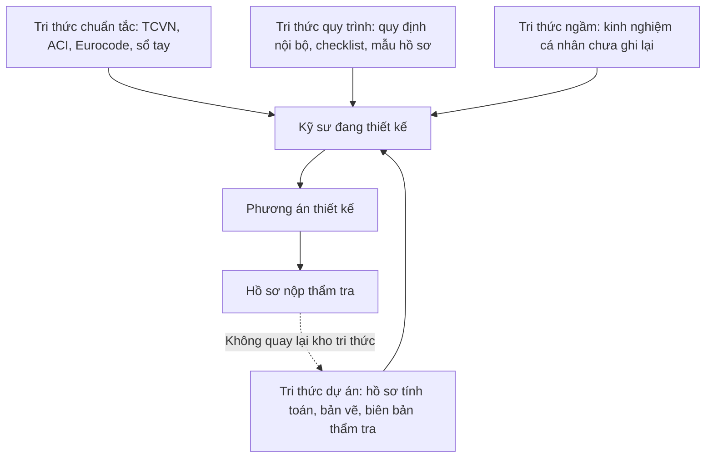

Vấn đề nằm ở đường nét đứt trong sơ đồ: **kết quả của một dự án hầu như không quay ngược lại
làm giàu kho tri thức của đơn vị**. Hồ sơ được lưu vào thư mục dự án và dừng ở đó. Không ai
gán nhãn "bài toán này là bài toán gì", "phương án chọn là gì", "vì sao chọn". Vì vậy dự án
thứ hai mươi vẫn phải giải lại bài toán mà dự án thứ ba đã giải xong.

### 2.2 Các vấn đề cụ thể

**Vấn đề 1 — Tri thức phân tán, không có điểm truy cập duy nhất**

Tài liệu nằm trên file server theo cây thư mục dự án, một phần nằm trong email trao đổi, một
phần trên máy cá nhân, một phần trong các nhóm chat. Công cụ tìm kiếm của hệ điều hành chỉ tìm
theo tên file, không tìm theo nội dung, và hoàn toàn không tìm được theo **ý nghĩa** của câu
hỏi. Một kỹ sư muốn biết "đơn vị đã từng xử lý móng trên nền đất yếu ở khu vực có mực nước
ngầm cao như thế nào" không có cách nào tìm ra ngoài việc hỏi người khác.

*Chi phí thực tế:* thời gian tra cứu bị tính vào giờ dự án nhưng không tạo ra giá trị mới, và
kết quả tra cứu phụ thuộc vào trí nhớ của người được hỏi.

**Vấn đề 2 — Không tra cứu được tiền lệ đã xử lý**

Đây là vấn đề nghiêm trọng hơn vấn đề 1, và ít được nhận ra hơn. Ngay cả khi tìm được hồ sơ
tính toán của một dự án cũ, kỹ sư vẫn phải tự đọc để hiểu bối cảnh: điều kiện đầu vào là gì,
phương án cuối cùng là gì, có bị thẩm tra bác không, đã sửa những gì. Thông tin này nằm rải
rác trong nhiều file khác nhau và thường không đầy đủ.

*Chi phí thực tế:* đơn vị không tận dụng được chính kinh nghiệm của mình. Mỗi dự án bắt đầu
gần như từ con số không về mặt tri thức tình huống.

**Vấn đề 3 — Tri thức của kỹ sư giàu kinh nghiệm không được tập trung hoá**

Những người có kinh nghiệm nhất thường là những người bận nhất. Họ trở thành nút thắt cổ chai:
mọi câu hỏi khó đều dồn về họ. Thời gian của họ bị tiêu vào việc trả lời lại những câu hỏi đã
trả lời nhiều lần, thay vì vào những bài toán thực sự cần đến kinh nghiệm của họ.

*Chi phí thực tế:* năng lực khan hiếm nhất bị sử dụng sai chỗ, và rủi ro tập trung vào cá nhân
rất cao — nếu người đó nghỉ, một mảng năng lực của đơn vị biến mất theo.

**Vấn đề 4 — Tính toán lặp lại**

Nhiều bài toán kỹ thuật có tính lặp cao: kiểm tra khả năng chịu uốn, chịu cắt, kiểm tra độ
võng, tính toán neo và nối thép. Các bài toán này thường được thực hiện bằng bảng tính Excel
truyền tay giữa các kỹ sư, mỗi người giữ một phiên bản riêng, và không ai chắc phiên bản nào
là bản đúng nhất.

*Chi phí thực tế:* ngoài thời gian lãng phí, còn có rủi ro chất lượng — hai kỹ sư dùng hai
phiên bản bảng tính khác nhau có thể ra hai kết quả khác nhau cho cùng một bài toán.

**Vấn đề 5 — Onboarding kỹ sư mới chậm**

Một kỹ sư mới ra trường cần thời gian dài để nắm được không chỉ kiến thức chuyên môn, mà cả
**cách làm của đơn vị**: dùng mẫu hồ sơ nào, quy ước đặt tên ra sao, mức độ chi tiết đến đâu
là đủ, những lỗi nào hay bị thẩm tra bắt. Toàn bộ phần này hiện được truyền đạt bằng miệng.

*Chi phí thực tế:* chi phí đào tạo cao, chất lượng đào tạo không đồng đều giữa các nhóm, và
thời gian của người hướng dẫn bị chiếm dụng đáng kể.

**Vấn đề 6 — Thiếu nhất quán giữa các nhóm thiết kế**

Khi mỗi nhóm dựa vào kinh nghiệm riêng và bộ công cụ riêng, kết quả thiết kế cho cùng một loại
bài toán có thể khác nhau đáng kể. Điều này gây khó khăn khi rà soát chéo, khi bàn giao giữa
các nhóm, và khi khách hàng so sánh hồ sơ giữa các dự án.

*Chi phí thực tế:* chi phí kiểm soát chất lượng tăng, và hình ảnh chuyên nghiệp của đơn vị
trước khách hàng bị ảnh hưởng.

### 2.3 Vì sao đến bây giờ mới giải được bài toán này

Câu hỏi hợp lý từ phía lãnh đạo: bài toán quản lý tri thức không mới, vì sao các nỗ lực trước
đây (xây dựng thư viện tài liệu, wiki nội bộ, quy định lưu hồ sơ) thường không thành công?

Nguyên nhân là **chi phí đóng góp luôn cao hơn lợi ích nhận lại đối với từng cá nhân**. Để một
wiki nội bộ hữu ích, kỹ sư phải bỏ công viết bài; nhưng người viết không phải là người hưởng
lợi. Ngoài ra, việc tìm kiếm trong wiki vẫn dựa trên từ khoá, nên ngay cả khi nội dung đã có,
người cần vẫn không tìm ra.

Ba yếu tố công nghệ mới thay đổi bài toán này:

| Yếu tố | Trước đây | Hiện nay |
|---|---|---|
| **Tìm kiếm theo ngữ nghĩa** | Chỉ tìm được theo từ khoá chính xác | Tìm được theo ý nghĩa câu hỏi, dù dùng từ khác |
| **Xử lý tài liệu không cấu trúc** | Phải nhập liệu thủ công vào biểu mẫu | Máy đọc trực tiếp PDF, DOCX, bảng tính |
| **Chi phí đóng góp tri thức** | Phải viết bài riêng | Ghi nhận ngay trong luồng làm việc, mất dưới 2 phút |

Yếu tố quyết định là khả năng **thu thập tri thức như một sản phẩm phụ của công việc thường
ngày**, thay vì như một nhiệm vụ bổ sung nằm ngoài quy trình. Đây là điều kiện mà các nỗ lực
trước đây không đáp ứng được.

### 2.4 Cơ hội — "Trợ lý tri thức kỹ thuật số"

Cơ hội của đơn vị không đơn thuần là "dùng AI cho hiện đại". Cơ hội là biến khối tài liệu và
hồ sơ đang nằm im thành một **tài sản vận hành được**.

Ở trạng thái hoàn chỉnh, hệ thống khai thác đồng thời ba nhóm nguồn dữ liệu:

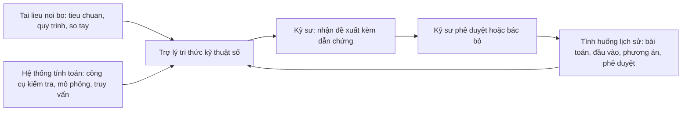

Điểm quan trọng nhất của sơ đồ là **vòng lặp khép kín ở dưới cùng**: mỗi lần kỹ sư phê duyệt
hay bác bỏ một đề xuất, dữ liệu đó quay trở lại kho tình huống. Hệ thống càng dùng càng giàu
tri thức, và tri thức đó thuộc về đơn vị, không thuộc về nhà cung cấp công nghệ nào.

Đây chính là điểm khác biệt giữa việc mua một công cụ AI thương mại và việc xây dựng một hệ
thống nội bộ: công cụ thương mại không biết gì về hồ sơ của đơn vị và không tích luỹ được gì
cho đơn vị. Hệ thống nội bộ tích luỹ một tài sản dữ liệu mà đối thủ không có.

### 2.5 Những gì hệ thống này không giải quyết

Để đề xuất trung thực, cần nêu rõ giới hạn:

- Hệ thống **không thay thế phần mềm phân tích kết cấu**. Nó gọi các phần mềm đó, không tính
  thay chúng.
- Hệ thống **không tự thiết kế** một công trình. Nó hỗ trợ ở mức từng bài toán cấu kiện và
  từng quyết định kỹ thuật cụ thể.
- Hệ thống **không thay thế quy trình kiểm soát chất lượng** hiện có. Nó bổ sung dữ liệu cho
  quy trình đó.
- Hệ thống **không cải thiện chất lượng tài liệu đầu vào**. Nếu tài liệu nội bộ mâu thuẫn hoặc
  lỗi thời, hệ thống sẽ phản ánh đúng sự mâu thuẫn đó. Việc rà soát tài liệu là công việc của
  con người và phải làm trước.

---

## 3. Tổng quan giải pháp đề xuất

### 3.1 Khái niệm hệ thống

**AI Engineering Assistant** là một ứng dụng nội bộ, truy cập qua trình duyệt, nơi kỹ sư đặt
câu hỏi bằng ngôn ngữ tự nhiên và nhận về câu trả lời kèm ba thứ luôn đi cùng nhau:

1. **Nội dung trả lời** — diễn đạt ngắn gọn, đúng ngôn ngữ chuyên môn của ngành.
2. **Dẫn chứng** — trích dẫn cụ thể tới tài liệu, trang, điều khoản, hoặc tình huống lịch sử.
3. **Kết quả kiểm định** — nếu câu hỏi liên quan đến tính toán, hệ thống chạy công cụ và đính
   kèm kết quả cùng tham số đầu vào đã dùng.

Nguyên tắc nền tảng, áp dụng xuyên suốt mọi thành phần: **AI là trợ lý hỗ trợ kỹ sư, không
thay thế kỹ sư.** Hệ thống chuẩn bị vật liệu cho quyết định; con người ra quyết định và chịu
trách nhiệm về quyết định đó.

### 3.2 Ba tầng năng lực

Hệ thống được cấu trúc thành ba tầng năng lực chồng lên nhau. Mỗi tầng có giá trị riêng và có
thể triển khai độc lập, nhưng giá trị tăng theo cấp số nhân khi cả ba cùng hoạt động.

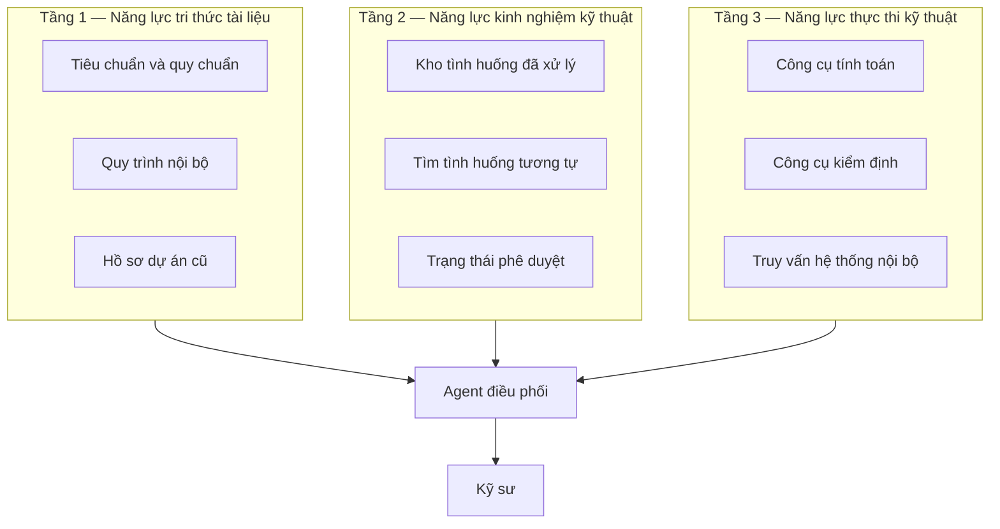

#### Tầng 1 — Năng lực tri thức tài liệu (RAG)

**Mục đích:** trả lời các câu hỏi có đáp án nằm sẵn trong tài liệu nội bộ.

**Cơ sở đề xuất:** đây là nhóm câu hỏi chiếm tỉ trọng lớn nhất trong công việc hằng ngày — tra
điều khoản tiêu chuẩn, tra quy định nội bộ, tra thông số vật liệu, tra cách trình bày hồ sơ.
Hiện tại nhóm câu hỏi này tốn nhiều thời gian nhất mà lại tạo ra ít giá trị trí tuệ nhất.

**Chức năng chính:** truy xuất và tổng hợp nội dung từ kho tài liệu nội bộ, kèm thông tin
nguồn phục vụ kiểm chứng.

**Luồng hoạt động:** tài liệu được xử lý trước, cắt thành đoạn, chuyển thành embedding và lưu
vào vector database. Khi có câu hỏi, hệ thống tìm các đoạn liên quan nhất, đưa chúng vào ngữ
cảnh cùng câu hỏi, rồi yêu cầu LLM trả lời **chỉ dựa trên các đoạn đó**. Chi tiết ở Mục 6.

**Giá trị mang lại:** giảm thời gian tra cứu; giảm phụ thuộc vào việc hỏi đồng nghiệp; đảm
bảo mọi người tra cùng một phiên bản tài liệu.

**Ví dụ nhóm câu hỏi thuộc tầng này:**
- "Theo quy định nội bộ, chiều dày lớp bê tông bảo vệ cho dầm trong môi trường ven biển là bao
  nhiêu?"
- "Mẫu thuyết minh tính toán kết cấu của đơn vị gồm những mục nào?"
- "TCVN 5574 quy định hàm lượng cốt thép tối thiểu cho dầm chịu uốn ra sao?"

#### Tầng 2 — Năng lực kinh nghiệm kỹ thuật (Historical Case Database)

**Mục đích:** trả lời các câu hỏi mà đáp án **không nằm trong tài liệu nào**, mà nằm trong
kinh nghiệm xử lý của đơn vị.

**Cơ sở đề xuất:** tiêu chuẩn cho biết giới hạn được phép, nhưng không cho biết **đơn vị thường
chọn phương án nào trong giới hạn đó**. Khoảng cách giữa "được phép" và "nên làm" chính là
kinh nghiệm — và đó là phần tài liệu không bao giờ ghi lại.

**Chức năng chính:** ghi nhận, chuẩn hoá và tra cứu lại các tình huống kỹ thuật đã được phê
duyệt trong đơn vị.

**Luồng hoạt động:** mỗi lần một bài toán kỹ thuật được xử lý và phê duyệt, hệ thống lưu lại
một bản ghi có cấu trúc gồm: mô tả bài toán, tham số đầu vào, kết quả tính toán, phương án
trước và sau, kết quả kiểm định, người phê duyệt và thời điểm. Khi có câu hỏi mới, hệ thống
tìm các bản ghi có điều kiện đầu vào tương tự. Chi tiết ở Mục 7.

**Giá trị mang lại:** biến kinh nghiệm cá nhân thành tài sản đơn vị; giảm rủi ro mất tri
thức khi nhân sự thay đổi; tăng tính nhất quán giữa các nhóm.

**Ví dụ nhóm câu hỏi thuộc tầng này:**
- "Đơn vị đã từng xử lý dầm nhịp lớn không đạt độ võng như thế nào?"
- "Với móng trên nền đất yếu, các dự án trước chọn giải pháp gì và kết quả ra sao?"
- "Phương án nào từng bị đơn vị thẩm tra bác bỏ, vì lý do gì?"

#### Tầng 3 — Năng lực thực thi kỹ thuật (Tool Calling)

**Mục đích:** để hệ thống **tính toán thật**, thay vì mô tả bằng lời cách tính.

**Cơ sở đề xuất:** đây là ranh giới an toàn quan trọng nhất. LLM không đáng tin khi làm số học,
và một con số sai trong hồ sơ kỹ thuật có hậu quả nghiêm trọng. Giải pháp không phải là "làm
cho AI giỏi toán hơn", mà là **không để AI tự tính**: mọi con số phải do một công cụ tính toán
đã được kiểm chứng sinh ra.

**Chức năng chính:** thực hiện các phép tính và kiểm định kỹ thuật thông qua công cụ đã được
chuẩn hoá và kiểm chứng.

**Luồng hoạt động:** các công cụ tính toán được đóng gói thành API có mô tả rõ tham số vào,
tham số ra. Agent chọn công cụ phù hợp, điền tham số, gọi, rồi diễn giải kết quả trả về. Toàn
bộ lời gọi được ghi nhật ký. Chi tiết ở Mục 5.

**Giá trị mang lại:** kết quả có thể tái lập và kiểm tra được; chuẩn hoá bộ công cụ tính
toán trong toàn đơn vị; loại bỏ tình trạng mỗi người một phiên bản bảng tính.

**Ví dụ nhóm câu hỏi thuộc tầng này:**
- "Kiểm tra khả năng chịu uốn của dầm 300×600, bê tông B25, thép CB400-V, cốt thép 6D20."
- "Với dầm này, cần bao nhiêu thép để hệ số an toàn đạt tối thiểu 1,15?"
- "Tra trong hệ thống: dự án nào đang dùng cấp bê tông B30 trở lên?"

### 3.3 Ba tầng phối hợp trong một câu hỏi thực tế

Hiệu quả của phương án thể hiện rõ nhất khi cả ba tầng cùng tham gia xử lý một yêu cầu. Bảng
dưới đây phân tách các bước xử lý đối với ví dụ đã nêu tại Mục 1:

| Bước | Tầng tham gia | Hệ thống làm gì | Kết quả trung gian |
|---|---|---|---|
| 1 | — | Hiểu câu hỏi, xác định đây là bài toán tăng cốt thép cho dầm chịu uốn | Nhận diện loại bài toán và cấu kiện |
| 2 | Tầng 3 | Gọi công cụ truy vấn thông số cấu kiện B12 từ hệ thống dự án | Tiết diện 300×600, B25, 6D20, M = 285 kNm |
| 3 | Tầng 1 | Truy xuất điều khoản tiêu chuẩn về hàm lượng cốt thép tối đa | TCVN 5574:2018, Điều 8.1 |
| 4 | Tầng 2 | Tìm tình huống tương tự đã phê duyệt | 4 tình huống, 3 đã duyệt |
| 5 | Tầng 3 | Gọi công cụ kiểm tra khả năng chịu uốn với phương án 8D25 | Đạt, hệ số 1,18 |
| 6 | — | Tổng hợp thành đề xuất kèm dẫn chứng | Đề xuất trình kỹ sư |
| 7 | — | Chờ kỹ sư phê duyệt; ghi nhận kết quả phê duyệt vào tầng 2 | Bản ghi tình huống mới |

Bước 7 là bước thường bị bỏ qua trong các hệ thống AI thông thường, và cũng là bước tạo ra giá
trị dài hạn lớn nhất: nó khiến hệ thống **học từ chính công việc của đơn vị**.

### 3.4 Nguyên tắc thiết kế xuyên suốt

Năm nguyên tắc dưới đây ràng buộc mọi lựa chọn kỹ thuật trong các mục tiếp theo:

| Nguyên tắc | Diễn giải | Thể hiện trong kiến trúc |
|---|---|---|
| **Minh bạch** | Người dùng luôn thấy được câu trả lời dựa trên căn cứ nào | Mọi câu trả lời có panel dẫn chứng, không ẩn nguồn |
| **Truy vết được** | Mọi lời gọi công cụ, mọi truy xuất tài liệu đều được ghi lại | Ba loại nhật ký ở Mục 8 |
| **Con người kiểm soát** | Kỹ sư có thể sửa tham số, chạy lại, bác bỏ đề xuất | Bước phê duyệt bắt buộc; tham số hiển thị và sửa được |
| **Không tự tính** | AI không sinh ra con số kỹ thuật từ suy đoán | Mọi số liệu đến từ công cụ hoặc từ tài liệu có trích dẫn |
| **Ưu tiên độ tin cậy** | Hệ thống được phép trả lời không đủ căn cứ thay vì suy đoán | Ngưỡng độ tin cậy trong truy xuất; phản hồi rõ khi không đủ dữ liệu |

---

## 4. Kiến trúc hệ thống tổng thể

### 4.1 Sơ đồ kiến trúc mức cao

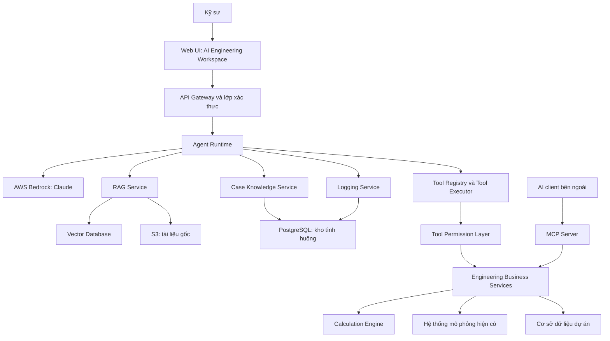

### 4.2 Giải thích từng thành phần

Dưới đây là mô tả của từng thành phần theo bốn câu hỏi: **làm gì — vì sao cần — hoạt động ra
sao — giá trị nghiệp vụ**.

#### 4.2.1 Web UI — AI Engineering Workspace

**Mục đích:** một giao diện chat đơn thuần không đủ cho công việc kỹ thuật. Kỹ sư cần nhìn
thấy đồng thời câu trả lời, tài liệu gốc, và bảng tham số tính toán để đối chiếu. Nếu phải
chuyển qua lại giữa nhiều cửa sổ, việc kiểm chứng trở nên tốn công đến mức người dùng bỏ qua —
và khi đó nguyên tắc "con người kiểm soát" chỉ còn trên giấy.

**Chức năng chính:** giao diện làm việc của kỹ sư, gồm ba cột: nguồn tri thức, hội thoại, và dẫn chứng.

**Luồng hoạt động:** ứng dụng một trang, giao tiếp với backend qua HTTPS; câu trả lời được
truyền theo dạng streaming để người dùng thấy tiến trình xử lý thay vì chờ màn hình trắng.

**Giá trị mang lại:** quyết định tỉ lệ chấp nhận của người dùng. Chi tiết ở Mục 9.

#### 4.2.2 API Gateway và lớp xác thực

**Mục đích:** hệ thống chứa dữ liệu dự án và tài liệu nội bộ. Cần biết chắc ai đang hỏi, và
người đó được phép thấy dữ liệu của dự án nào. Không có lớp này thì mọi kiểm soát phía sau đều
vô nghĩa.

**Chức năng chính:** điểm vào duy nhất của hệ thống; xác thực người dùng, phân quyền, giới hạn tần suất
gọi, ghi nhận truy cập.

**Luồng hoạt động:** tích hợp với hệ thống danh tính hiện có của đơn vị (Active Directory
hoặc tương đương) qua chuẩn OIDC; phát hành token có thời hạn ngắn; mọi lời gọi xuống Agent
Runtime đều mang danh tính người dùng.

**Giá trị mang lại:** đảm bảo dữ liệu dự án không rò rỉ giữa các nhóm; đáp ứng yêu cầu bảo
mật của chủ đầu tư.

#### 4.2.3 Agent Runtime

**Mục đích:** một câu hỏi kỹ thuật thường cần nhiều bước — tra tài liệu, tra tình huống, gọi
công cụ tính toán — và số bước không biết trước. Nếu lập trình cứng theo luồng cố định, hệ
thống chỉ xử lý được đúng những câu hỏi đã lường trước. Agent Runtime cho phép xử lý các câu
hỏi chưa lường trước bằng cách quyết định bước tiếp theo dựa trên kết quả bước trước.

**Chức năng chính:** đóng vai trò lớp điều phối trung tâm. Thành phần này tiếp nhận yêu cầu,
phân tích ý định, xác định trình tự xử lý, điều phối việc gọi các dịch vụ phía sau và tổng hợp
kết quả thành câu trả lời kèm dẫn chứng.

**Luồng hoạt động:** vòng lặp suy luận — gọi công cụ — quan sát kết quả, có giới hạn số vòng và
giới hạn thời gian. Chi tiết ở Mục 5.

**Giá trị mang lại:** cho phép hệ thống xử lý được các yêu cầu nhiều bước, thay vì chỉ đáp
ứng các yêu cầu tra cứu đơn lẻ.

#### 4.2.4 AWS Bedrock

**Mục đích:** đây là phần đơn vị không nên tự xây. Huấn luyện và vận hành một mô hình ngôn
ngữ chất lượng cao đòi hỏi năng lực và chi phí vượt xa quy mô hợp lý của một đơn vị tư vấn.

**Chức năng chính:** cung cấp mô hình ngôn ngữ để hiểu câu hỏi và diễn đạt câu trả lời.

**Luồng hoạt động:** gọi qua API trong phạm vi tài khoản AWS của đơn vị; dữ liệu gửi đi
không được dùng để huấn luyện mô hình; có thể chọn vùng triển khai theo yêu cầu.

**Giá trị mang lại:** sử dụng được năng lực mô hình ngôn ngữ ở mức chất lượng cao mà không
phát sinh đầu tư hạ tầng; chi phí
tính theo mức sử dụng thực tế, không có chi phí cố định lớn ban đầu.

#### 4.2.5 RAG Service

**Mục đích:** mô hình ngôn ngữ không biết gì về tài liệu nội bộ của đơn vị. RAG là cầu nối
giữa năng lực ngôn ngữ chung và dữ liệu riêng của đơn vị.

**Chức năng chính:** tìm và trả về các đoạn tài liệu liên quan nhất tới câu hỏi, kèm thông tin nguồn.

**Luồng hoạt động:** chuyển câu hỏi thành embedding, tìm các đoạn gần nghĩa nhất trong vector
database, kết hợp với tìm kiếm từ khoá, sắp xếp lại theo mức liên quan. Chi tiết ở Mục 6.

**Giá trị mang lại:** chuyển khối tài liệu hiện đang lưu trữ thụ động thành nguồn tri thức
khai thác được trong công việc hằng ngày.

#### 4.2.6 Case Knowledge Service

**Mục đích:** đây là nơi tri thức kinh nghiệm của đơn vị được tích luỹ. Nếu không có thành
phần này, hệ thống chỉ đọc lại được những gì đã có sẵn trong tài liệu.

**Chức năng chính:** quản lý kho tình huống kỹ thuật — ghi nhận, tìm kiếm theo điều kiện tương tự, thống
kê.

**Luồng hoạt động:** kết hợp truy vấn có cấu trúc (lọc theo loại cấu kiện, khoảng nhịp, cấp
bê tông) với tìm kiếm ngữ nghĩa trên phần mô tả. Chi tiết ở Mục 7.

**Giá trị mang lại:** tài sản tri thức thuộc sở hữu đơn vị, tăng giá trị theo thời gian.

#### 4.2.7 Tool Registry và Tool Executor

**Mục đích:** cần một nơi duy nhất định nghĩa "AI được phép làm gì". Danh mục này là ranh
giới năng lực của hệ thống, và mở rộng năng lực đồng nghĩa với việc thêm công cụ vào danh mục —
một thao tác có kiểm soát, có phê duyệt.

**Chức năng chính:** Tool Registry lưu danh mục các công cụ khả dụng kèm mô tả tham số; Tool Executor thực
thi lời gọi và trả kết quả.

**Luồng hoạt động:** mỗi công cụ khai báo tên, mô tả, lược đồ tham số vào/ra, mức quyền yêu cầu
và mức rủi ro. Tool Executor xác thực tham số theo lược đồ trước khi gọi.

**Giá trị mang lại:** kiểm soát được chính xác phạm vi hành động của AI; mở rộng dần theo mức
độ tin cậy tích luỹ.

#### 4.2.8 Tool Permission Layer

**Mục đích:** quyền phải được kiểm tra theo **người dùng cuối**, không theo hệ thống AI. Nếu
Agent Runtime hoạt động dưới một tài khoản có toàn quyền, người dùng có thể truy xuất dữ liệu
của bất kỳ dự án nào thông qua hệ thống, kể cả các dự án không thuộc phạm vi được phân công.

**Chức năng chính:** kiểm tra người dùng hiện tại có quyền thực hiện lời gọi công cụ này trên dữ liệu này
hay không.

**Luồng hoạt động:** mỗi lời gọi công cụ mang theo danh tính người dùng; lớp này đối chiếu với ma
trận quyền trước khi cho phép thực thi. Chi tiết ở Mục 12.

**Giá trị mang lại:** ngăn rò rỉ dữ liệu nội bộ; đáp ứng cam kết bảo mật với chủ đầu tư.

#### 4.2.9 Engineering Business Services

**Mục đích:** logic nghiệp vụ phải nằm ở một nơi duy nhất, được kiểm thử và kiểm soát phiên
bản, và được dùng chung bởi mọi thành phần gọi tới — bao gồm cả ứng dụng web, cả AI, cả MCP.

**Chức năng chính:** tầng dịch vụ nghiệp vụ chứa toàn bộ logic kỹ thuật: tính toán, kiểm định, truy vấn
dữ liệu dự án.

**Luồng hoạt động:** các dịch vụ độc lập, giao tiếp qua API nội bộ; mỗi dịch vụ có bộ kiểm
thử riêng và có phiên bản rõ ràng.

**Giá trị mang lại:** đảm bảo cùng một bài toán luôn cho cùng một kết quả, bất kể được gọi từ
đâu. Đây là điều kiện bắt buộc để kết quả dùng được trong hồ sơ.

#### 4.2.10 Calculation Engine

**Mục đích:** để có một nguồn tính toán duy nhất, thay cho tình trạng nhiều phiên bản bảng
tính khác nhau trôi nổi trong đơn vị.

**Chức năng chính:** thực hiện các phép tính kỹ thuật đã được chuẩn hoá và kiểm chứng.

**Luồng hoạt động:** mỗi bài toán được đóng gói thành một hàm có tham số vào rõ ràng, có bộ
test đối chiếu với kết quả tính tay đã được kỹ sư trưởng xác nhận, và có ghi rõ tiêu chuẩn áp
dụng cùng phiên bản.

**Giá trị mang lại:** chuẩn hoá chất lượng tính toán; giảm rủi ro sai sót; tạo nền cho việc
tự động hoá sâu hơn về sau.

#### 4.2.11 Logging Service

**Mục đích:** vì hai lý do độc lập. Thứ nhất, để truy vết khi có sự cố hoặc khi cần giải
trình. Thứ hai — và quan trọng hơn về lâu dài — vì chính nhật ký là nguyên liệu để xây dựng
kho tri thức của đơn vị.

**Chức năng chính:** ghi lại ba loại nhật ký — hội thoại, thực thi công cụ, và tình huống kỹ thuật.

**Luồng hoạt động:** ghi bất đồng bộ để không làm chậm luồng trả lời; lưu vào PostgreSQL với
chính sách lưu trữ và ẩn danh rõ ràng. Chi tiết ở Mục 8.

**Giá trị mang lại:** biến hoạt động sử dụng hằng ngày thành dữ liệu tài sản.

#### 4.2.12 MCP Server

**Mục đích:** bảo đảm tầng dịch vụ nghiệp vụ không bị ràng buộc vào một ứng dụng duy nhất.
Khi đơn vị triển khai ứng dụng AI tiếp theo, hoặc khi cần đưa công cụ nội bộ vào môi trường làm
việc khác, bộ công cụ đã sẵn sàng để tái sử dụng.

**Chức năng chính:** công bố bộ công cụ nghiệp vụ theo chuẩn MCP để các ứng dụng AI khác sử
dụng lại.

**Luồng hoạt động:** tiếp nhận yêu cầu theo chuẩn MCP, ánh xạ sang lời gọi API nghiệp vụ nội
bộ và chuyển tiếp kết quả; không chứa logic tính toán. Chi tiết tại Mục 11.

**Giá trị mang lại:** bảo vệ giá trị đầu tư dài hạn; tránh phụ thuộc vào một nhà cung cấp.

### 4.3 Luồng xử lý một yêu cầu điển hình

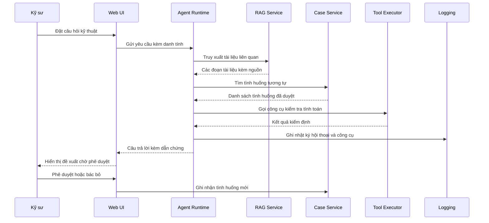

### 4.4 Nguyên tắc phân tách trách nhiệm

Kiến trúc trên tuân theo một quy tắc đơn giản nhưng có hệ quả lớn: **mỗi tầng chỉ biết tầng
ngay dưới nó**.

| Tầng | Được phép gọi | Không được phép |
|---|---|---|
| Web UI | API Gateway | Gọi thẳng Agent hoặc dịch vụ nghiệp vụ |
| Agent Runtime | RAG, Case, Tool Executor, LLM | Truy cập cơ sở dữ liệu trực tiếp |
| Tool Executor | Tool Permission Layer | Bỏ qua kiểm tra quyền |
| Business Services | Cơ sở dữ liệu, hệ thống bên ngoài | Gọi ngược lên Agent |
| MCP Server | Business Services | Chứa logic nghiệp vụ riêng |

Quy tắc này đảm bảo mọi đường đi tới dữ liệu đều phải qua điểm kiểm soát quyền, và không có
đường tắt nào tồn tại — kể cả khi có người muốn tạo ra một đường tắt để "cho nhanh".

---

## 5. Kiến trúc AI Agent

### 5.1 Vì sao cần một Agent, không chỉ cần một chatbot

Một chatbot thông thường hoạt động theo mô hình một chiều: nhận câu hỏi, sinh câu trả lời. Mô
hình này đủ cho các câu hỏi có đáp án nằm trọn trong một đoạn văn bản, nhưng không đủ cho công
việc kỹ thuật, vì phần lớn câu hỏi kỹ thuật đòi hỏi **nhiều bước phụ thuộc lẫn nhau**.

Đối với yêu cầu *"Dầm B12 không đạt kiểm tra ứng suất, cần tăng cốt thép bao nhiêu"*, quá
trình xử lý đòi hỏi tối thiểu ba bước phụ thuộc: truy vấn thông số tiết diện của cấu kiện từ cơ
sở dữ liệu dự án; tra cứu tình huống tương tự trên cơ sở thông số vừa truy vấn; và thực hiện
kiểm định đối với phương án đề xuất. Số lượng và thứ tự các bước không xác định trước mà phụ
thuộc vào kết quả của bước liền trước.

Agent Runtime là thành phần thực hiện chuỗi bước đó. Nó không phải là "AI thông minh hơn" — nó
là **một vòng lặp có kiểm soát**, trong đó LLM chỉ đóng vai trò quyết định bước tiếp theo, còn
mọi hành động thực tế đều do các công cụ đã được phê duyệt thực hiện.

### 5.2 Trách nhiệm của Agent Runtime

| Trách nhiệm | Nội dung | Ràng buộc an toàn |
|---|---|---|
| **Tiếp nhận yêu cầu** | Nhận câu hỏi kèm ngữ cảnh: dự án đang mở, cấu kiện đang xem, lịch sử hội thoại | Chỉ nhận ngữ cảnh mà người dùng có quyền truy cập |
| **Xác định ý định** | Phân loại câu hỏi: tra tài liệu, tra tình huống, yêu cầu tính toán, hay kết hợp | Nếu không phân loại được, hỏi lại thay vì đoán |
| **Lập kế hoạch bước tiếp theo** | Quyết định gọi công cụ nào với tham số nào | Chỉ được chọn trong danh mục công cụ đã đăng ký |
| **Gọi công cụ** | Gửi yêu cầu tới Tool Executor và chờ kết quả | Có timeout; có giới hạn số lần gọi mỗi phiên |
| **Quan sát và điều chỉnh** | Đọc kết quả, quyết định tiếp tục hay dừng | Có giới hạn số vòng lặp tối đa |
| **Tổng hợp kết quả** | Diễn đạt câu trả lời kèm dẫn chứng đầy đủ | Không được nêu số liệu không có nguồn |
| **Bàn giao cho con người** | Trình bày đề xuất ở trạng thái chờ phê duyệt | Không có cơ chế tự phê duyệt |

### 5.3 Vòng lặp hoạt động của Agent

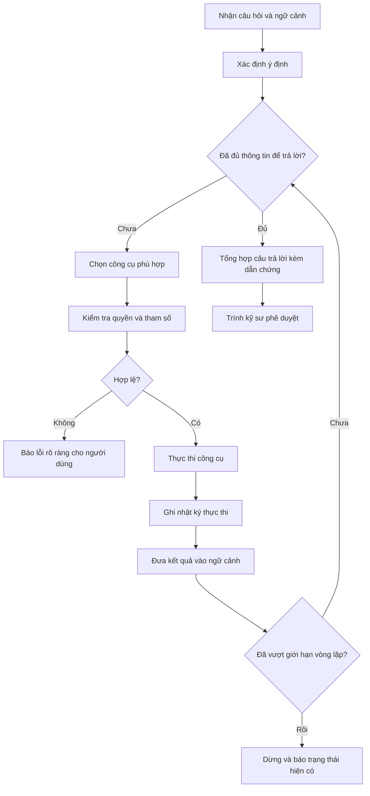

Hai nhánh cần chú ý trong sơ đồ, vì chúng thể hiện nguyên tắc thiết kế chứ không chỉ là chi
tiết kỹ thuật:

- **Nhánh "Báo lỗi rõ ràng"**: khi tham số không hợp lệ hoặc người dùng không đủ quyền, hệ
  thống thông báo rõ lý do, thay vì bỏ qua bước xử lý đó và tiếp tục trả lời trên dữ liệu
  không đầy đủ. Câu trả lời dựa trên dữ liệu không đầy đủ mà không có cảnh báo là dạng lỗi có
  mức độ nghiêm trọng cao nhất trong hệ thống.
- **Nhánh "Vượt giới hạn vòng lặp"**: nếu Agent không hội tụ sau số bước cho phép, nó dừng và
  trình bày các kết quả đã thu thập được, thay vì tiếp tục lặp hoặc đưa ra kết luận không có
  căn cứ.

### 5.4 Tool Calling — cơ chế và ý nghĩa an toàn

**Nguyên tắc cốt lõi: AI không truy cập trực tiếp bất kỳ hệ thống nào.**

Chuỗi truy cập bắt buộc:

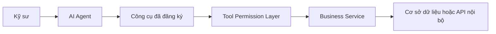

Mỗi mũi tên trong chuỗi này là một điểm kiểm soát:

| Điểm | Kiểm soát gì | Ngăn chặn được điều gì |
|---|---|---|
| Kỹ sư → Agent | Xác thực danh tính, phạm vi dự án | Người ngoài truy cập hệ thống |
| Agent → Công cụ | Chỉ chọn được công cụ trong danh mục | AI thực hiện hành động ngoài dự kiến |
| Công cụ → Permission Layer | Kiểm tra quyền theo người dùng cuối | Lộ dữ liệu dự án không thuộc quyền |
| Permission → Service | Xác thực lược đồ tham số | Tham số sai kiểu, ngoài khoảng cho phép |
| Service → Dữ liệu | Logic nghiệp vụ và ràng buộc dữ liệu | Ghi dữ liệu sai, thao tác không hợp lệ |

**Vì sao đây là lợi ích bảo mật quyết định:** nếu cho AI quyền sinh câu lệnh SQL và chạy trực
tiếp, thì phạm vi thiệt hại tiềm tàng bằng đúng quyền của tài khoản cơ sở dữ liệu — nghĩa là
gần như không giới hạn. Khi AI chỉ được gọi công cụ, phạm vi hành động của nó bằng đúng tập công cụ
đã đăng ký, và mỗi công cụ đã được rà soát trước khi đưa vào danh mục. Đây là khác biệt giữa một
rủi ro không giới hạn và một rủi ro đã được liệt kê hết.

Một lợi ích phụ nhưng quan trọng: vì mọi hành động đều đi qua công cụ, **mọi hành động đều được
ghi nhật ký ở cùng một chỗ**. Không có đường đi nào của AI mà hệ thống không nhìn thấy.

### 5.5 Phân loại công cụ theo mức rủi ro

Không phải công cụ nào cũng có mức rủi ro như nhau. Hệ thống phân công cụ thành ba nhóm với chế độ
kiểm soát khác nhau:

| Nhóm | Đặc điểm | Ví dụ | Chế độ kiểm soát |
|---|---|---|---|
| **Nhóm A — Chỉ đọc** | Không thay đổi dữ liệu | Tra thông số cấu kiện, tra tài liệu, tra tình huống | Agent gọi tự do trong phạm vi quyền của người dùng |
| **Nhóm B — Tính toán** | Không thay đổi dữ liệu, nhưng kết quả có thể vào hồ sơ | Kiểm tra khả năng chịu uốn, tính độ võng | Gọi tự do, nhưng kết quả luôn hiển thị kèm tham số đầu vào để kỹ sư đối chiếu |
| **Nhóm C — Ghi dữ liệu** | Thay đổi trạng thái hệ thống | Ghi tình huống mới, cập nhật thông số cấu kiện | Bắt buộc có xác nhận của người dùng trước khi thực thi |

Trong giai đoạn 1 và 2, chỉ triển khai nhóm A và B. Nhóm C chỉ được mở khi hệ thống đã vận
hành ổn định và đội ngũ đã tin tưởng vào chất lượng đề xuất.

### 5.6 Quản lý ngữ cảnh và chi phí

Mỗi lời gọi tới LLM có chi phí tính theo lượng văn bản gửi đi và nhận về. Một Agent thiết kế
kém có thể gửi lại toàn bộ lịch sử hội thoại và toàn bộ tài liệu ở mỗi vòng lặp, khiến chi phí
tăng theo cấp số nhân.

Ba biện pháp kiểm soát được áp dụng:

1. **Chọn lọc ngữ cảnh:** chỉ đưa vào ngữ cảnh các đoạn tài liệu thực sự liên quan (thường 5–8
   đoạn), không đưa toàn bộ tài liệu.
2. **Tóm tắt lịch sử:** với hội thoại dài, các lượt cũ được tóm tắt lại thay vì giữ nguyên văn.
3. **Ngân sách theo phiên:** mỗi phiên có giới hạn số vòng lặp và giới hạn tổng lượng văn bản
   xử lý; vượt ngưỡng thì Agent dừng và báo cho người dùng.

Các biện pháp này cần được đưa vào thiết kế **ngay từ đầu**. Bổ sung sau khi hệ thống đã chạy
là công việc tốn kém và thường phải sửa lại kiến trúc.

### 5.7 Xử lý trường hợp Agent không chắc chắn

Đây là phần thể hiện rõ nhất nguyên tắc AD-08. Hệ thống có ba mức phản hồi khi độ tin cậy
không đủ:

| Tình huống | Phản hồi của hệ thống |
|---|---|
| Không tìm thấy tài liệu liên quan | "Không tìm thấy căn cứ trong tài liệu nội bộ về nội dung này. Đề nghị tham khảo trực tiếp tiêu chuẩn hoặc liên hệ chủ nhiệm bộ môn." |
| Tìm thấy tài liệu nhưng nội dung mâu thuẫn | Trình bày cả hai nguồn kèm ghi chú rõ về mâu thuẫn, không tự chọn một bên |
| Tình huống lịch sử tương tự nhưng khác biệt về điều kiện | Nêu rõ các điểm khác biệt so với bài toán hiện tại, để kỹ sư tự đánh giá mức độ áp dụng được |

Ba phản hồi này không phải là "hệ thống hoạt động kém". Chúng là hệ thống hoạt động đúng thiết
kế. Một trợ lý biết nói "tôi không chắc" là trợ lý dùng được lâu dài.

---

## 6. Kiến trúc RAG

### 6.1 Cơ chế hoạt động của RAG

Một mô hình ngôn ngữ được huấn luyện trên dữ liệu công khai. Nó biết rất nhiều về kỹ thuật xây
dựng nói chung, nhưng **không biết gì về tài liệu của đơn vị**: quy trình nội bộ, mẫu hồ sơ,
hồ sơ dự án cũ, các quy ước riêng.

Có hai cách khắc phục. Cách thứ nhất là huấn luyện lại mô hình trên dữ liệu nội bộ
(fine-tuning). Cách thứ hai là RAG: **giữ nguyên mô hình, nhưng mỗi lần hỏi thì tìm sẵn các
đoạn tài liệu liên quan và đưa vào cùng câu hỏi**, kèm chỉ thị rõ ràng: chỉ được trả lời dựa
trên các đoạn này.

Phương án thứ hai được lựa chọn (AD-01). Về mặt xử lý, phương án này phát sinh thêm bước truy
xuất tài liệu trước khi sinh câu trả lời, làm tăng thời gian phản hồi ở mức không đáng kể.
Bù lại, phương án đáp ứng được ba yêu cầu mà fine-tuning không đáp ứng: khả năng trích dẫn
nguồn, khả năng cập nhật tức thì khi tài liệu thay đổi, và khả năng giới hạn phạm vi tra cứu
theo quyền truy cập của người dùng.

### 6.2 Vì sao RAG là bắt buộc trong bối cảnh kỹ thuật

| Lý do | Diễn giải |
|---|---|
| **Câu trả lời dựa trên dữ liệu nội bộ** | Kỹ sư cần biết quy định áp dụng tại đơn vị, không phải thông lệ chung của ngành |
| **Giảm hallucination** | Khi bị ràng buộc chỉ sử dụng các đoạn tài liệu đã cung cấp, tỉ lệ nội dung không chính xác giảm đáng kể |
| **Cung cấp dẫn chứng** | Mỗi câu trả lời chỉ ra được nguồn: tên tài liệu, trang, điều khoản — điều kiện bắt buộc để dùng trong hồ sơ |
| **Cập nhật tức thì** | Thay tài liệu mới, hệ thống trả lời theo bản mới sau khi xử lý lại, không cần huấn luyện |
| **Kiểm soát phạm vi** | Có thể giới hạn hệ thống chỉ tra trong tập tài liệu mà người hỏi được phép xem |

Điểm thứ ba đáng nhấn mạnh với lãnh đạo: **một câu trả lời không có dẫn chứng thì không dùng
được trong hồ sơ kỹ thuật**, dù nội dung có đúng. Kỹ sư ký hồ sơ phải chỉ ra được căn cứ.
RAG là kiến trúc duy nhất trong các lựa chọn hiện có đáp ứng được yêu cầu này một cách tự
nhiên.

### 6.3 Quy trình xử lý tài liệu

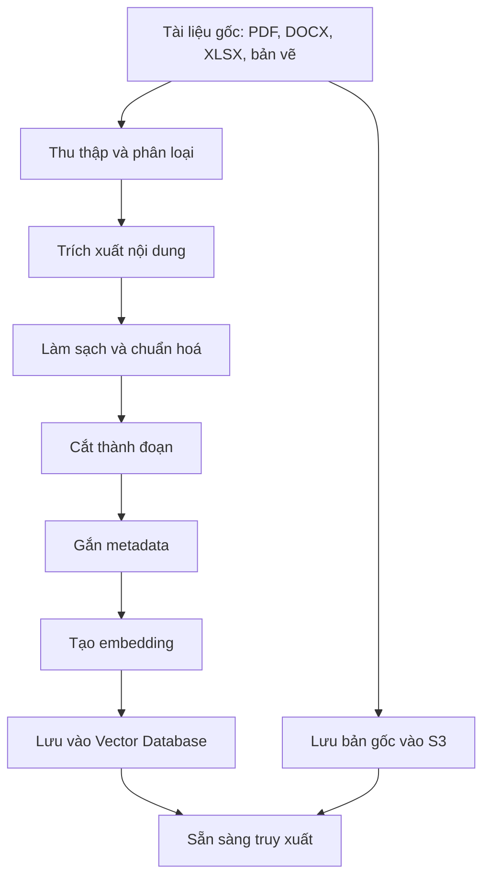

#### 6.3.1 Thu thập và phân loại

**Mục đích:** không phải mọi tài liệu đều đáng đưa vào hệ thống. Một bản nháp cũ hoặc một
tiêu chuẩn đã hết hiệu lực sẽ làm ô nhiễm kho tri thức. Bước phân loại là bước **con người
phải làm**, không tự động hoá được hoàn toàn.

**Chức năng chính:** đưa tài liệu từ các nguồn phân tán vào một nơi tập trung, gán loại tài liệu và mức
độ ưu tiên.

**Phân loại đề xuất:**

| Loại tài liệu | Ví dụ | Ưu tiên |
|---|---|---|
| Tiêu chuẩn, quy chuẩn | TCVN, ACI, Eurocode | Cao — đưa vào trước |
| Quy trình nội bộ | Quy định lập hồ sơ, checklist kiểm tra | Cao |
| Sổ tay kỹ thuật | Sổ tay thiết kế, bảng tra vật liệu | Cao |
| Thuyết minh tính toán dự án | Hồ sơ đã nghiệm thu | Trung bình — cần rà soát bảo mật |
| Biên bản thẩm tra | Ý kiến và phản hồi | Cao — chứa tri thức quý hiếm |
| Bản vẽ | DWG, PDF | Thấp ở giai đoạn 1 — cần xử lý riêng |

**Giá trị mang lại:** chất lượng đầu ra của toàn hệ thống bị giới hạn bởi chất lượng bước
này. Đây là nơi đơn vị cần đầu tư thời gian của kỹ sư có kinh nghiệm.

#### 6.3.2 Trích xuất nội dung

**Mục đích:** máy không đọc trực tiếp được PDF hay DOCX theo cách hiểu được ngữ nghĩa; cần
tách ra văn bản, bảng biểu, tiêu đề, chú thích.

**Chức năng chính:** chuyển tài liệu từ định dạng gốc sang văn bản có cấu trúc.

**Luồng hoạt động:** dùng thư viện trích xuất cho từng định dạng; với PDF quét ảnh, dùng OCR
có hỗ trợ tiếng Việt. Bảng biểu được giữ nguyên cấu trúc hàng — cột thay vì làm phẳng thành
văn xuôi, vì bảng tra vật liệu mất cấu trúc là bảng vô dụng.

**Điểm cần lưu ý:** tài liệu kỹ thuật tiếng Việt thường có công thức, ký hiệu và chỉ số dưới.
Bước này cần được kiểm tra thủ công trên một mẫu đại diện trước khi xử lý hàng loạt.

**Giá trị mang lại:** quyết định việc hệ thống có tra được bảng biểu và công thức hay không —
vốn là phần kỹ sư cần tra nhiều nhất.

#### 6.3.3 Cắt thành đoạn (chunking)

**Mục đích:** không thể đưa cả một tiêu chuẩn 300 trang vào ngữ cảnh mỗi lần hỏi. Cần tìm và
đưa vào đúng phần liên quan.

**Chức năng chính:** chia tài liệu dài thành các đoạn nhỏ, mỗi đoạn đủ ngắn để đưa vào ngữ cảnh và đủ
dài để tự nó có nghĩa.

**Luồng hoạt động:** cắt theo cấu trúc tài liệu (chương, điều, mục) thay vì cắt theo số ký tự
cố định. Với tiêu chuẩn kỹ thuật, một điều khoản là một đơn vị ngữ nghĩa tự nhiên và nên là
một đoạn. Các đoạn liền kề có phần chồng lấn để không mất ngữ cảnh ở ranh giới.

**Điểm cần lưu ý:** phương án cắt đoạn không phù hợp là một trong các nguyên nhân chính làm
giảm chất lượng truy xuất. Một điều khoản
bị cắt đôi giữa chừng sẽ cho ra hai đoạn đều vô nghĩa.

**Giá trị mang lại:** ảnh hưởng trực tiếp tới độ chính xác của câu trả lời.

#### 6.3.4 Gắn metadata

**Mục đích:** metadata phục vụ ba mục đích thiết yếu — lọc theo quyền truy cập, lọc theo hiệu
lực (không trả lời theo tiêu chuẩn đã hết hiệu lực), và tạo trích dẫn chính xác.

**Chức năng chính:** gắn cho mỗi đoạn các thông tin: thuộc tài liệu nào, trang nào, điều khoản nào, loại
tài liệu gì, hiệu lực từ ngày nào, thuộc dự án nào, mức truy cập ra sao.

**Giá trị mang lại:** không có metadata thì không có dẫn chứng, và không có dẫn chứng thì hệ
thống không dùng được cho công việc kỹ thuật.

#### 6.3.5 Tạo embedding và lưu trữ

**Mục đích:** để tìm kiếm theo ý nghĩa. Hai đoạn văn bản dùng từ ngữ khác nhau nhưng cùng nói
về độ võng của dầm sẽ có biểu diễn số gần nhau, nên tìm được nhau.

**Chức năng chính:** chuyển mỗi đoạn văn bản thành một dãy số biểu diễn ý nghĩa của đoạn đó, lưu vào
vector database.

**Luồng hoạt động:** gọi mô hình embedding, lưu vector kèm metadata và tham chiếu tới bản gốc.

**Giá trị mang lại:** đây là cơ chế cho phép kỹ sư hỏi bằng ngôn ngữ tự nhiên thay vì phải
đoán đúng từ khoá có trong tài liệu.

### 6.4 Quy trình truy xuất khi có câu hỏi

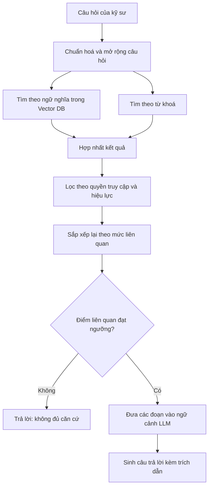

Ba điểm thiết kế đáng chú ý:

**Kết hợp hai phương pháp tìm kiếm.** Tìm theo ngữ nghĩa tốt cho câu hỏi diễn đạt tự do, nhưng
kém khi cần khớp chính xác một mã hiệu — ví dụ "TCVN 5574" hay "cấu kiện B12". Tìm theo từ khoá
ngược lại. Kết hợp cả hai cho kết quả tốt hơn hẳn từng phương pháp riêng lẻ trong bối cảnh kỹ
thuật, nơi mã hiệu xuất hiện dày đặc.

**Lọc quyền trước khi đưa vào ngữ cảnh.** Việc lọc phải xảy ra **trước** khi nội dung được gửi
tới LLM, không phải sau. Nếu lọc sau, dữ liệu ngoài quyền đã bị gửi đi rồi.

**Ngưỡng độ liên quan.** Nếu đoạn tài liệu tốt nhất tìm được vẫn có điểm liên quan thấp, hệ
thống trả lời "không đủ căn cứ" thay vì cố ghép một câu trả lời từ tài liệu không liên quan.

### 6.5 Cấu trúc câu trả lời có dẫn chứng

Mỗi câu trả lời từ tầng RAG có cấu trúc cố định:

```json
{
  "answer": "Theo quy định nội bộ, chiều dày lớp bê tông bảo vệ cho dầm trong môi trường ven biển tối thiểu là 40 mm.",
  "citations": [
    {
      "document_id": "QT-KC-012",
      "document_title": "Quy dinh thiet ke ket cau — Ban 3.2",
      "section": "Muc 4.3",
      "page": 18,
      "effective_from": "2024-06-01",
      "excerpt": "Lop be tong bao ve toi thieu doi voi cau kien trong moi truong xam thuc trung binh: 40 mm.",
      "relevance_score": 0.91
    }
  ],
  "confidence": "high",
  "conflicting_sources": []
}
```

Cấu trúc này cho phép giao diện hiển thị đúng những gì kỹ sư cần để kiểm chứng: nội dung trích
dẫn, vị trí trong tài liệu, ngày hiệu lực, và cảnh báo nếu có nguồn mâu thuẫn.

### 6.6 Vận hành và cập nhật kho tài liệu

RAG không phải là hệ thống "làm một lần rồi xong". Cần có quy trình vận hành:

| Hoạt động | Tần suất | Người chịu trách nhiệm |
|---|---|---|
| Bổ sung tài liệu mới | Khi phát sinh | Bộ phận kỹ thuật đề nghị, quản trị hệ thống xử lý |
| Đánh dấu tài liệu hết hiệu lực | Khi có phiên bản mới | Chủ sở hữu tài liệu |
| Rà soát chất lượng trả lời | Hằng tháng | Nhóm vận hành cùng đại diện kỹ thuật |
| Xử lý lại toàn bộ khi đổi mô hình embedding | Hiếm — khi nâng cấp lớn | Nhóm kỹ thuật hệ thống |

Điểm thứ hai quan trọng và thường bị bỏ sót: **tài liệu hết hiệu lực phải được đánh dấu, không
phải xoá**. Xoá đi thì không giải thích được vì sao hồ sơ cũ lại làm theo cách cũ. Đánh dấu hết
hiệu lực cho phép hệ thống vừa không dùng nó để trả lời câu hỏi hiện tại, vừa tra lại được khi
cần giải trình hồ sơ cũ.

---

## 7. Hệ thống tri thức tình huống kỹ thuật

Mục này trình bày thành phần có giá trị dài hạn lớn nhất trong toàn bộ phương án kiến trúc:
kho tri thức tình huống kỹ thuật (Engineering Case Knowledge Base). Đây cũng là thành phần
khác biệt nhất so với các giải pháp trợ lý AI thương mại có sẵn trên thị trường.

### 7.1 Mục đích

Thành phần này được thiết kế nhằm ghi nhận, chuẩn hoá và khai thác lại các quyết định kỹ thuật
đã được phê duyệt trong quá trình thực hiện dự án.

Cơ sở của yêu cầu này xuất phát từ một khoảng trống nghiệp vụ: hệ thống tài liệu nội bộ mô tả
**giới hạn được phép** theo tiêu chuẩn, nhưng không mô tả **thông lệ thiết kế thực tế** của
đơn vị. Khoảng cách giữa hai nội dung này chính là kinh nghiệm kỹ thuật, và hiện nay kinh
nghiệm đó chỉ tồn tại ở dạng tri thức cá nhân, không được lưu trữ ở bất kỳ hệ thống nào.

### 7.2 Chức năng chính

| Chức năng | Mô tả |
|---|---|
| Ghi nhận tình huống | Lưu bản ghi có cấu trúc cho mỗi bài toán kỹ thuật đã xử lý và được phê duyệt |
| Chuẩn hoá dữ liệu | Kiểm tra tính đầy đủ và hợp lệ của các trường bắt buộc trước khi ghi nhận |
| Tra cứu tương tự | Tìm các tình huống có điều kiện đầu vào gần với bài toán đang xử lý |
| Quản lý trạng thái phê duyệt | Theo dõi trạng thái của từng tình huống: đề xuất, đã duyệt, bị bác, đã thay thế |
| Thống kê và phân tích | Cung cấp số liệu tổng hợp phục vụ công tác quản lý chất lượng thiết kế |

### 7.3 Yêu cầu về dữ liệu có cấu trúc

Phương án lưu trữ tri thức tình huống dưới dạng dữ liệu có cấu trúc (structured data) thay vì
dưới dạng văn bản tự do là một quyết định kiến trúc đã nêu tại AD-03. Mục này trình bày cơ sở
của quyết định đó.

**Hạn chế của phương án lưu trữ dạng văn bản.** Nếu chỉ lưu lịch sử trao đổi dưới dạng văn
bản và khai thác qua RAG, hệ thống gặp bốn hạn chế không khắc phục được:

| Hạn chế | Hệ quả nghiệp vụ |
|---|---|
| Không lọc được theo tham số số học | Không thể truy vấn "các dầm nhịp từ 7,0 m đến 7,5 m, bê tông cấp B25" |
| Không kiểm tra được tính đầy đủ | Không phát hiện được trường hợp thiếu thông tin đầu vào quan trọng |
| Không thống kê được | Không trả lời được câu hỏi quản trị như "tỉ lệ phương án bị thẩm tra bác trong quý" |
| Không liên kết được với kết quả kiểm định | Không phân biệt được đề xuất đã kiểm chứng với đề xuất chưa kiểm chứng |

**Ưu điểm của phương án dữ liệu có cấu trúc.** Khi mỗi tình huống được lưu với các trường xác
định, hệ thống có khả năng: truy vấn chính xác theo điều kiện kỹ thuật; xác thực dữ liệu tại
thời điểm ghi nhận; tổng hợp số liệu phục vụ quản lý; và về dài hạn, phân tích xu hướng thiết
kế của đơn vị.

Cần lưu ý rằng hai phương án không loại trừ nhau. Kiến trúc đề xuất sử dụng **mô hình lai**:
các trường số học và phân loại được lưu có cấu trúc phục vụ truy vấn chính xác; phần mô tả bài
toán và lý do lựa chọn được lưu dạng văn bản và được tạo embedding phục vụ tra cứu theo ngữ
nghĩa.

### 7.4 Mô hình dữ liệu tình huống kỹ thuật

Cấu trúc bản ghi tình huống được đề xuất như sau. Ví dụ minh hoạ sử dụng dữ liệu giả định.

```json
{
  "case_id": "CASE-2026-000412",
  "created_at": "2026-03-12T09:24:00+07:00",
  "project_ref": "PRJ-2025-018",
  "discipline": "ket-cau",
  "element_type": "dam",
  "element_ref": "B12",

  "problem": {
    "category": "khong-dat-kiem-tra-chiu-uon",
    "summary": "Dam B12 khong dat kiem tra kha nang chiu uon tai tiet dien giua nhip",
    "trigger": "ket-qua-phan-tich-etabs"
  },

  "input": {
    "width_mm": 300,
    "height_mm": 600,
    "span_mm": 7200,
    "concrete_grade": "B25",
    "steel_grade": "CB400-V",
    "cover_mm": 30,
    "design_moment_kNm": 285,
    "load_combination": "1.1DL + 1.2LL"
  },

  "solution": {
    "before": "6D20",
    "after": "8D25",
    "as_before_mm2": 1885,
    "as_after_mm2": 3927,
    "rho_after_percent": 2.18,
    "alternatives_considered": [
      "tang-chieu-cao-tiet-dien-len-650mm",
      "nang-cap-be-tong-len-B30"
    ],
    "rationale": "Giu nguyen kich thuoc tiet dien de khong anh huong chieu cao thong thuy va he thong ky thuat da bo tri. Phuong an tang cot thep dat yeu cau ma khong phat sinh thay doi kien truc."
  },

  "verification": {
    "status": "PASS",
    "công cụ": "calc.beam.flexure",
    "tool_version": "1.4.2",
    "standard": "TCVN 5574:2018",
    "safety_factor": 1.18,
    "executed_at": "2026-03-12T09:31:00+07:00",
    "log_ref": "TOOLLOG-2026-118273"
  },

  "approval": {
    "status": "approved",
    "approved_by": "user:ktv-0157",
    "approved_role": "chu-tri-bo-mon-ket-cau",
    "approved_at": "2026-03-12T14:05:00+07:00",
    "comment": "Chap thuan. Luu y kiem tra khoang cach cot thep va dieu kien thi cong khi bo tri 8D25 trong be rong 300 mm."
  },

  "review_outcome": {
    "external_review": "passed",
    "review_body": "don-vi-tham-tra-doc-lap",
    "review_date": "2026-04-08"
  },

  "provenance": {
    "source_documents": ["QT-KC-012#4.3", "TCVN-5574-2018#8.1"],
    "similar_cases_used": ["CASE-2025-000188", "CASE-2024-000902"],
    "conversation_ref": "CONV-2026-004417"
  }
}
```

### 7.5 Giải thích các nhóm trường dữ liệu

| Nhóm trường | Mục đích | Vì sao bắt buộc |
|---|---|---|
| `problem` | Phân loại bài toán theo danh mục chuẩn | Cho phép thống kê theo loại bài toán và tìm tình huống cùng loại |
| `input` | Ghi nhận đầy đủ điều kiện đầu vào ở dạng số | Là cơ sở duy nhất để đánh giá mức độ tương đồng giữa hai tình huống |
| `solution` | Phương án trước, phương án sau và các phương án đã cân nhắc | Trường `alternatives_considered` ghi lại các phương án bị loại — thông tin có giá trị cao và hiện không được lưu ở bất kỳ đâu |
| `verification` | Kết quả kiểm định kèm phiên bản công cụ và tiêu chuẩn áp dụng | Bảo đảm khả năng tái lập kết quả; phân biệt đề xuất đã kiểm chứng với chưa kiểm chứng |
| `approval` | Danh tính, vai trò, thời điểm và ý kiến của người phê duyệt | Xác lập trách nhiệm kỹ thuật; là điều kiện để tình huống được dùng làm tiền lệ |
| `review_outcome` | Kết quả thẩm tra của đơn vị độc lập | Phân biệt phương án được nội bộ chấp thuận với phương án đã qua thẩm tra bên ngoài |
| `provenance` | Nguồn tài liệu và các tình huống đã tham chiếu | Cho phép truy vết ngược toàn bộ căn cứ của một quyết định |

Trường `approval` cần được nhấn mạnh trong quá trình phê duyệt chủ trương: **một tình huống
chỉ được hệ thống sử dụng làm tiền lệ khi đã có trạng thái `approved`**. Các đề xuất do hệ
thống sinh ra nhưng chưa được phê duyệt được lưu ở trạng thái riêng, không tham gia vào quá
trình tra cứu tương tự. Cơ chế này ngăn hiện tượng hệ thống tự củng cố các đề xuất chưa được
con người xác nhận.

### 7.6 Luồng hoạt động

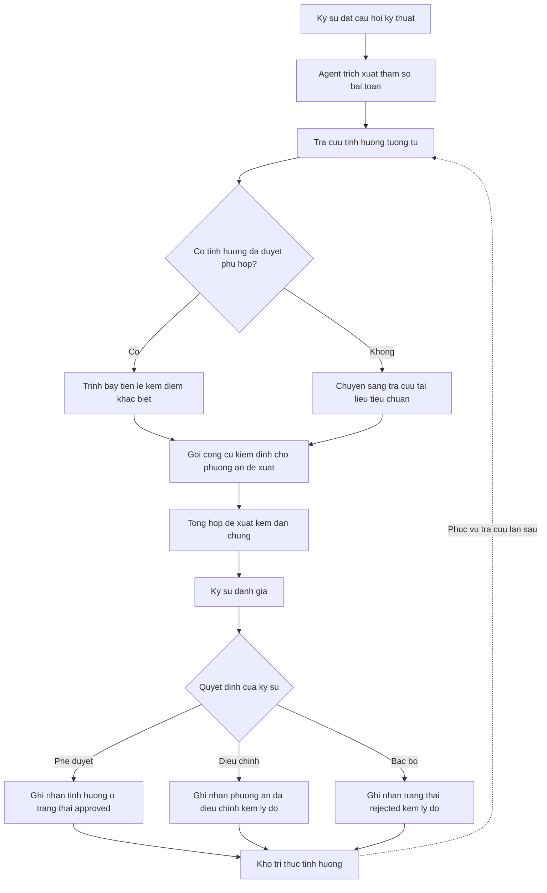

Ba nhánh quyết định ở cuối sơ đồ đều dẫn tới việc ghi nhận dữ liệu. Trường hợp kỹ sư bác bỏ đề
xuất có giá trị thông tin không kém trường hợp phê duyệt: nó xác định ranh giới áp dụng của
các tiền lệ và là cơ sở để cải thiện chất lượng đề xuất trong các phiên bản tiếp theo.

### 7.7 Cơ chế xác định tình huống tương tự

Việc xác định mức độ tương đồng giữa hai tình huống kỹ thuật được thực hiện theo ba bước, kết
hợp truy vấn có cấu trúc và tra cứu theo ngữ nghĩa:

**Bước 1 — Lọc theo điều kiện bắt buộc.** Loại bỏ các tình huống không cùng loại cấu kiện,
không cùng nhóm bài toán, hoặc áp dụng tiêu chuẩn đã hết hiệu lực. Bước này thu hẹp tập dữ
liệu bằng truy vấn có cấu trúc, chi phí thấp.

**Bước 2 — Tính khoảng cách trên các tham số số học.** Với các tình huống còn lại, tính mức độ
sai khác trên từng tham số đầu vào theo trọng số do bộ phận kỹ thuật quy định. Ví dụ đối với
bài toán dầm chịu uốn:

| Tham số | Trọng số đề xuất | Cơ sở |
|---|---|---|
| Cấp bê tông | Cao | Ảnh hưởng trực tiếp đến khả năng chịu lực |
| Nhóm cốt thép | Cao | Ảnh hưởng trực tiếp đến khả năng chịu lực |
| Tỉ số nhịp trên chiều cao | Cao | Quyết định dạng làm việc của cấu kiện |
| Bề rộng tiết diện | Trung bình | Ảnh hưởng đến điều kiện bố trí cốt thép |
| Mô men thiết kế | Trung bình | Đã phản ánh gián tiếp qua các tham số khác |
| Chiều dày lớp bảo vệ | Thấp | Biến thiên trong phạm vi hẹp |

Bộ trọng số này phải do kỹ sư chuyên môn quy định, không do đội phát triển phần mềm tự đặt.
Đây là điểm cần phân định trách nhiệm rõ trong giai đoạn triển khai.

**Bước 3 — Tra cứu theo ngữ nghĩa trên phần mô tả.** Hai tình huống có tham số gần nhau vẫn có
thể khác nhau về bối cảnh — ví dụ một trường hợp bị ràng buộc chiều cao thông thuỷ, một trường
hợp không. Phần mô tả bài toán và lý do lựa chọn được tra cứu theo ngữ nghĩa để bổ sung yếu tố
bối cảnh vào kết quả xếp hạng.

Kết quả trả về cho kỹ sư luôn kèm **bảng so sánh điểm khác biệt** giữa tình huống tham chiếu và
bài toán hiện tại, thay vì chỉ trả về mức độ tương đồng dưới dạng một con số. Kỹ sư cần thông
tin để tự đánh giá khả năng áp dụng, không cần một kết luận đã được rút gọn.

### 7.8 Cơ chế thu thập dữ liệu

Rủi ro lớn nhất của thành phần này là **không có dữ liệu đầu vào** (đã nêu tại giả định GĐ-06).
Nếu việc ghi nhận tình huống được thiết kế như một nhiệm vụ bổ sung ngoài luồng công việc, tỉ
lệ tuân thủ trong thực tế sẽ rất thấp.

Phương án thiết kế áp dụng nguyên tắc **ghi nhận trong luồng** (in-workflow capture):

| Nguyên tắc | Cách hiện thực |
|---|---|
| Điền sẵn tối đa | Hệ thống tự điền các trường đã biết từ ngữ cảnh phiên làm việc: tham số cấu kiện, kết quả tính toán, tài liệu đã tra cứu |
| Thao tác tối thiểu | Kỹ sư chỉ cần xác nhận, bổ sung lý do lựa chọn và bấm phê duyệt |
| Gắn với thao tác sẵn có | Việc ghi nhận diễn ra tại đúng thời điểm kỹ sư ra quyết định, không phải một biểu mẫu riêng điền sau |
| Lợi ích trực tiếp | Bản ghi tình huống có thể xuất thành phụ lục thuyết minh, phục vụ ngay công việc lập hồ sơ |

Điểm cuối cùng là yếu tố quyết định tỉ lệ áp dụng: nếu bản ghi tình huống đồng thời là một sản
phẩm phục vụ công việc hiện tại của kỹ sư, việc ghi nhận trở thành hoạt động có lợi ngay lập
tức thay vì một yêu cầu hành chính.

Ngoài ra, giai đoạn 3 bao gồm một hoạt động **số hoá tình huống lịch sử**: rà soát các hồ sơ dự
án đã nghiệm thu và chuyển một phần thành bản ghi tình huống. Hoạt động này cần sự tham gia của
kỹ sư có kinh nghiệm và nên được tổ chức theo từng đợt có mục tiêu số lượng cụ thể.

### 7.9 Kiểm soát chất lượng dữ liệu tình huống

Kho tri thức tình huống chỉ có giá trị nếu dữ liệu bên trong đáng tin cậy. Bốn cơ chế kiểm soát
được đề xuất:

| Cơ chế | Nội dung | Thời điểm áp dụng |
|---|---|---|
| Xác thực khi ghi nhận | Kiểm tra các trường bắt buộc, kiểm tra khoảng giá trị hợp lệ của tham số kỹ thuật | Tự động, tại thời điểm ghi |
| Bắt buộc có kết quả kiểm định | Tình huống không có trường `verification` không được dùng làm tiền lệ | Tự động |
| Rà soát định kỳ | Bộ phận kỹ thuật rà soát mẫu ngẫu nhiên hằng quý | Định kỳ, thủ công |
| Quản lý vòng đời | Đánh dấu tình huống đã lỗi thời khi tiêu chuẩn áp dụng thay đổi | Khi có thay đổi tiêu chuẩn |

Cơ chế thứ tư có ý nghĩa đặc biệt: khi một tiêu chuẩn được thay thế, toàn bộ tình huống tham
chiếu tiêu chuẩn cũ phải được đánh dấu để hệ thống không tiếp tục sử dụng làm tiền lệ cho các
bài toán mới. Các bản ghi này vẫn được lưu giữ phục vụ mục đích giải trình hồ sơ cũ.

### 7.10 Giá trị mang lại

| Khía cạnh | Giá trị |
|---|---|
| Vận hành | Rút ngắn thời gian xử lý các bài toán đã có tiền lệ trong đơn vị |
| Chất lượng | Tăng tính nhất quán giữa các nhóm thiết kế thông qua tham chiếu chung |
| Quản trị | Cung cấp số liệu định lượng về hoạt động thiết kế phục vụ công tác quản lý chất lượng |
| Nhân sự | Giảm phụ thuộc vào tri thức cá nhân; rút ngắn thời gian đào tạo kỹ sư mới |
| Tài sản | Hình thành một tập dữ liệu chuyên ngành thuộc sở hữu của đơn vị, có giá trị tăng dần theo thời gian |

Giá trị cuối cùng cần được xem xét ở góc độ chiến lược. Tập dữ liệu tình huống kỹ thuật đã
được phê duyệt và kiểm chứng là loại dữ liệu không thể mua được trên thị trường và không có
sẵn trong bất kỳ mô hình ngôn ngữ thương mại nào. Đây là yếu tố tạo khác biệt bền vững của
đơn vị so với việc chỉ sử dụng công cụ AI phổ thông.

---

## 8. Kiến trúc dữ liệu và nhật ký

### 8.1 Mục đích

Hệ thống nhật ký (logging) trong phương án này phục vụ đồng thời hai yêu cầu khác nhau về bản
chất:

1. **Yêu cầu vận hành và kiểm soát:** truy vết nguyên nhân khi có sự cố, xác định trách nhiệm
   khi có tranh chấp về nội dung hồ sơ, đáp ứng yêu cầu kiểm toán nội bộ.
2. **Yêu cầu tích luỹ tri thức:** nhật ký là nguồn dữ liệu đầu vào để hình thành kho tri thức
   tình huống và để đánh giá, cải thiện chất lượng hệ thống theo thời gian.

Yêu cầu thứ hai thường bị bỏ qua trong các dự án phần mềm thông thường. Trong phương án này,
nhật ký được thiết kế ngay từ đầu như một thành phần dữ liệu nghiệp vụ, không phải như một
tiện ích kỹ thuật phụ trợ.

### 8.2 Ba nhóm nhật ký

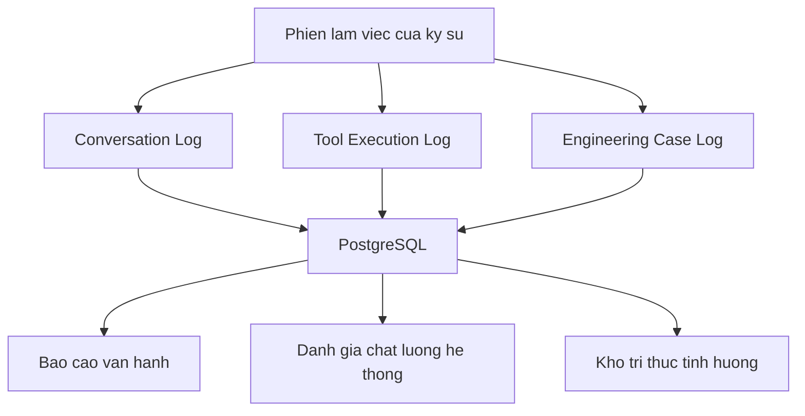

#### 8.2.1 Conversation Log — nhật ký hội thoại

**Mục đích:** ghi nhận toàn bộ nội dung trao đổi giữa kỹ sư và hệ thống.

**Cấu trúc dữ liệu chính:**

| Trường | Nội dung |
|---|---|
| `conversation_id` | Định danh phiên trao đổi |
| `user_ref` | Định danh người dùng |
| `project_ref` | Dự án trong phạm vi phiên làm việc |
| `question` | Nội dung câu hỏi |
| `answer` | Nội dung trả lời |
| `citations` | Danh sách tài liệu và vị trí đã trích dẫn |
| `retrieval_scores` | Điểm liên quan của các đoạn tài liệu đã truy xuất |
| `model_ref`, `model_version` | Mô hình và phiên bản đã sử dụng |
| `token_usage` | Khối lượng xử lý, phục vụ theo dõi chi phí |
| `latency_ms` | Thời gian phản hồi |
| `user_feedback` | Đánh giá của người dùng về chất lượng trả lời |

**Giá trị mang lại:** cho phép xác định các nhóm câu hỏi hệ thống trả lời kém, các tài liệu
thường được truy xuất nhưng không hữu ích, và các khoảng trống tri thức trong kho tài liệu.
Đây là dữ liệu đầu vào trực tiếp cho công tác cải thiện chất lượng hệ thống.

#### 8.2.2 Tool Execution Log — nhật ký thực thi công cụ

**Mục đích:** ghi nhận mọi lời gọi công cụ nghiệp vụ do hệ thống thực hiện.

**Cấu trúc dữ liệu chính:**

| Trường | Nội dung |
|---|---|
| `execution_id` | Định danh lần thực thi |
| `conversation_ref` | Liên kết tới phiên trao đổi tương ứng |
| `tool_name`, `tool_version` | Công cụ và phiên bản đã gọi |
| `input_params` | Toàn bộ tham số đầu vào |
| `output_result` | Kết quả trả về |
| `status` | Trạng thái: thành công, lỗi, từ chối do thiếu quyền |
| `permission_check` | Kết quả kiểm tra phân quyền |
| `duration_ms` | Thời gian thực thi |
| `executed_for_user` | Danh tính người dùng mà lời gọi được thực hiện thay mặt |

**Giá trị mang lại:** đây là nhật ký có ý nghĩa pháp lý cao nhất trong hệ thống. Khi cần giải
trình một con số trong hồ sơ, bản ghi này cho phép xác định chính xác công cụ nào, phiên bản
nào, tham số nào đã tạo ra con số đó. Trường `tool_version` là bắt buộc: kết quả tính toán chỉ
tái lập được khi biết phiên bản công cụ.

#### 8.2.3 Engineering Case Log — nhật ký tình huống kỹ thuật

**Mục đích:** ghi nhận quyết định kỹ thuật cuối cùng và quá trình dẫn tới quyết định đó.

Cấu trúc dữ liệu đã trình bày chi tiết tại Mục 7.4. Điểm cần lưu ý về mặt kiến trúc dữ liệu là
nhóm nhật ký này liên kết tới hai nhóm còn lại thông qua các trường `conversation_ref` và
`log_ref`, tạo thành một chuỗi truy vết hoàn chỉnh:

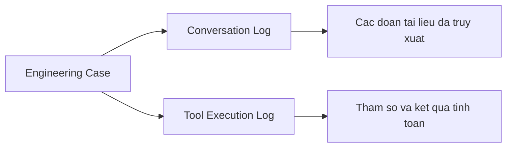

**Giá trị mang lại:** từ một quyết định kỹ thuật trong hồ sơ, có thể truy ngược tới toàn bộ căn
cứ: câu hỏi ban đầu, tài liệu đã tham chiếu, công cụ đã chạy, tham số đã dùng, và người đã phê
duyệt. Khả năng truy vết này là yêu cầu cơ bản đối với hồ sơ kỹ thuật và hiện chưa hệ thống nào
trong đơn vị đáp ứng được.

### 8.3 Mô hình dữ liệu tổng thể

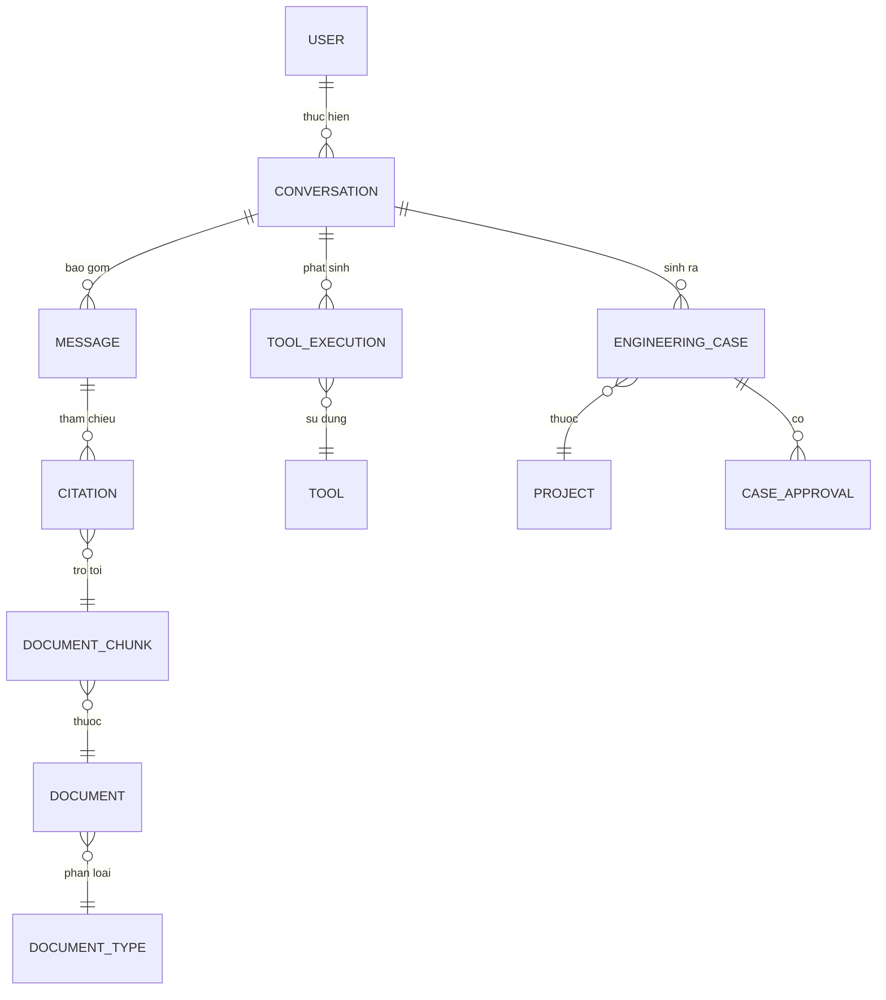

### 8.4 Chính sách lưu trữ và bảo vệ dữ liệu

| Nhóm dữ liệu | Thời hạn lưu trữ đề xuất | Ghi chú |
|---|---|---|
| Conversation Log | 24 tháng ở dạng đầy đủ, sau đó ẩn danh | Giữ nội dung kỹ thuật, loại bỏ định danh cá nhân |
| Tool Execution Log | Theo thời hạn lưu trữ hồ sơ dự án | Có giá trị giải trình, không được xoá trước thời hạn hồ sơ |
| Engineering Case | Không giới hạn | Là tài sản tri thức của đơn vị |
| Tài liệu gốc | Theo quy định lưu trữ hiện hành của đơn vị | Không thay đổi so với quy định hiện tại |

Ba nguyên tắc bảo vệ dữ liệu được áp dụng:

1. **Mã hoá dữ liệu khi lưu trữ và khi truyền.** Áp dụng cho toàn bộ dữ liệu, không phân biệt
   mức độ nhạy cảm.
2. **Phân tách theo dự án.** Dữ liệu nhật ký mang định danh dự án và chịu cùng chính sách phân
   quyền truy cập như hồ sơ dự án.
3. **Kiểm soát truy cập nhật ký.** Quyền đọc nhật ký được cấp riêng, không mặc định đi kèm
   quyền sử dụng hệ thống.

### 8.5 Chỉ số theo dõi vận hành

Hệ thống cần cung cấp báo cáo định kỳ cho bộ phận quản lý với các chỉ số sau:

| Nhóm chỉ số | Chỉ số cụ thể | Mục đích sử dụng |
|---|---|---|
| Mức độ sử dụng | Số người dùng hoạt động, số câu hỏi theo bộ phận | Đánh giá mức độ tiếp nhận của người dùng |
| Chất lượng | Tỉ lệ câu trả lời có dẫn chứng, tỉ lệ phản hồi tích cực | Đánh giá hiệu quả của hệ thống truy xuất |
| Khoảng trống tri thức | Danh sách câu hỏi không tìm được căn cứ | Xác định tài liệu cần bổ sung |
| Tích luỹ tri thức | Số tình huống được phê duyệt theo tháng | Đo tốc độ hình thành tài sản tri thức |
| Chi phí | Chi phí xử lý theo tháng, chi phí trung bình một câu hỏi | Kiểm soát ngân sách vận hành |
| Hiệu năng | Thời gian phản hồi trung bình và phân vị 95 | Bảo đảm trải nghiệm sử dụng |

Nhóm chỉ số "Khoảng trống tri thức" có giá trị quản trị cao và thường bị bỏ qua: danh sách các
câu hỏi mà hệ thống không trả lời được chính là danh sách các tài liệu mà đơn vị đang thiếu.

---

## 9. Kiến trúc giao diện người dùng

### 9.1 Mục đích

Giao diện người dùng của hệ thống được thiết kế theo mô hình **không gian làm việc kỹ thuật**
(AI Engineering Workspace), không theo mô hình cửa sổ trao đổi thông thường.

Cơ sở của lựa chọn này: trong công việc kỹ thuật, câu trả lời chỉ có giá trị khi kỹ sư kiểm
chứng được căn cứ của nó. Nếu việc kiểm chứng đòi hỏi mở nhiều cửa sổ và tra cứu thủ công,
chi phí kiểm chứng sẽ vượt quá lợi ích và người dùng sẽ bỏ qua bước này. Khi đó nguyên tắc
"con người kiểm soát" chỉ tồn tại trên tài liệu, không tồn tại trong vận hành thực tế.

### 9.2 Bố cục ba cột

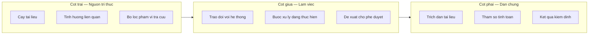

#### 9.2.1 Cột trái — Nguồn tri thức

**Chức năng chính:** hiển thị phạm vi tri thức mà hệ thống đang sử dụng và cho phép người dùng
điều chỉnh phạm vi đó.

**Thành phần:**

| Thành phần | Nội dung |
|---|---|
| Cây tài liệu | Danh mục tài liệu theo phân loại, cho phép giới hạn phạm vi tra cứu |
| Tình huống liên quan | Danh sách tình huống kỹ thuật tương tự đã được phê duyệt |
| Bộ lọc phạm vi | Giới hạn theo dự án, theo loại tài liệu, theo hiệu lực thời gian |

**Giá trị mang lại:** người dùng kiểm soát được nguồn dữ liệu mà hệ thống sử dụng. Trong trường
hợp câu trả lời không phù hợp, người dùng có thể thu hẹp phạm vi và yêu cầu xử lý lại thay vì
chỉ đặt lại câu hỏi.

#### 9.2.2 Cột giữa — Không gian làm việc

**Chức năng chính:** tiếp nhận yêu cầu, hiển thị tiến trình xử lý và trình bày đề xuất.

**Yêu cầu thiết kế quan trọng:** hệ thống phải hiển thị **các bước xử lý đang thực hiện**, ví
dụ: "Đang tra cứu tài liệu tiêu chuẩn", "Đang tìm tình huống tương tự", "Đang thực hiện kiểm
tra khả năng chịu uốn". Việc hiển thị này không chỉ nhằm mục đích trải nghiệm sử dụng, mà là
yêu cầu về tính minh bạch: người dùng cần biết hệ thống đã làm gì để tạo ra kết quả.

Đề xuất được trình bày ở trạng thái **chờ phê duyệt**, với ba thao tác khả dụng: phê duyệt,
điều chỉnh, hoặc bác bỏ kèm lý do.

#### 9.2.3 Cột phải — Dẫn chứng và kiểm định

**Chức năng chính:** trình bày toàn bộ căn cứ của câu trả lời ở dạng có thể kiểm chứng trực
tiếp.

**Thành phần:**

| Thành phần | Nội dung |
|---|---|
| Trích dẫn tài liệu | Đoạn văn bản gốc, tên tài liệu, số trang, điều khoản, ngày hiệu lực |
| Bảng tham số tính toán | Toàn bộ tham số đầu vào đã sử dụng, ở dạng có thể chỉnh sửa |
| Kết quả kiểm định | Kết quả, hệ số an toàn, tiêu chuẩn áp dụng, phiên bản công cụ |

**Yêu cầu thiết kế quan trọng:** bảng tham số phải cho phép chỉnh sửa và chạy lại. Khi kỹ sư
không đồng ý với một tham số mà hệ thống đã tự xác định, thao tác cần thiết là sửa tham số đó
và yêu cầu tính lại — không phải diễn đạt lại câu hỏi. Đây là điểm khác biệt cơ bản giữa một
công cụ kỹ thuật và một giao diện trao đổi thông thường.

### 9.3 Nguyên tắc thiết kế trải nghiệm

| Nguyên tắc | Yêu cầu cụ thể |
|---|---|
| **Tính minh bạch** | Hiển thị các bước xử lý; hiển thị nguồn dữ liệu; hiển thị mức độ tin cậy |
| **Dựa trên dẫn chứng** | Không hiển thị số liệu kỹ thuật nào không kèm nguồn hoặc kết quả công cụ |
| **Người dùng kiểm soát** | Cho phép sửa tham số, giới hạn phạm vi, chạy lại, bác bỏ |
| **Trạng thái rõ ràng** | Phân biệt trực quan giữa: đã kiểm định, chưa kiểm định, đã phê duyệt, bị bác |
| **Không gây hiểu nhầm về thẩm quyền** | Ngôn ngữ giao diện dùng "đề xuất", "tham khảo", không dùng "kết luận", "quyết định" |

Nguyên tắc cuối cùng cần được kiểm soát chặt trong quá trình thiết kế nội dung giao diện. Cách
dùng từ trong giao diện ảnh hưởng trực tiếp tới cách người dùng hiểu về vai trò của hệ thống.

### 9.4 Yêu cầu phi chức năng đối với giao diện

| Yêu cầu | Mức đề xuất | Cơ sở |
|---|---|---|
| Thời gian hiển thị phản hồi đầu tiên | Dưới 3 giây | Duy trì cảm nhận về tính tương tác |
| Thời gian hoàn tất câu trả lời có gọi công cụ | Dưới 30 giây | Phù hợp với thời gian chờ chấp nhận được trong công việc kỹ thuật |
| Hỗ trợ trình duyệt | Các phiên bản hiện hành của trình duyệt phổ biến | Không phát sinh yêu cầu cài đặt phần mềm |
| Khả năng sử dụng trên màn hình lớn | Tối ưu cho độ phân giải từ 1920×1080 | Phù hợp môi trường làm việc kỹ thuật |
| Xuất dữ liệu | Xuất đề xuất và dẫn chứng thành tệp phục vụ đính kèm hồ sơ | Yêu cầu nghiệp vụ trực tiếp |

Yêu cầu cuối cùng có tác động lớn tới mức độ tiếp nhận của người dùng: khi kết quả từ hệ thống
có thể đưa thẳng vào hồ sơ dưới dạng phụ lục, hệ thống trở thành một phần của quy trình làm
việc thay vì một công cụ tra cứu bên ngoài.

---

## 10. Đề xuất technology stack

### 10.1 Nguyên tắc lựa chọn công nghệ

Phương án công nghệ được lựa chọn theo bốn tiêu chí, xếp theo thứ tự ưu tiên:

1. **Khả năng vận hành với đội ngũ hiện có.** Công nghệ tối ưu về mặt kỹ thuật nhưng không có
   người vận hành được là công nghệ không phù hợp.
2. **Mức độ phổ biến trên thị trường lao động.** Bảo đảm khả năng tuyển dụng và thay thế nhân
   sự.
3. **Chi phí vận hành theo quy mô thực tế.** Ưu tiên các thành phần có chi phí tăng theo mức sử
   dụng, tránh chi phí cố định lớn ở giai đoạn đầu.
4. **Khả năng thay thế.** Hạn chế phụ thuộc vào một nhà cung cấp duy nhất ở các thành phần cốt
   lõi.

### 10.2 Danh mục công nghệ đề xuất

| Lớp | Thành phần | Công nghệ đề xuất | Cơ sở lựa chọn |
|---|---|---|---|
| Giao diện | Web application | React, TypeScript | Phổ biến, hệ sinh thái thư viện đầy đủ, dễ tuyển dụng |
| Giao diện | Hệ thống giao diện | Tailwind CSS kèm bộ component nội bộ | Bảo đảm tính nhất quán, giảm chi phí phát triển giao diện |
| Ứng dụng | API và Agent Runtime | Node.js, TypeScript | Dùng chung ngôn ngữ với giao diện; hệ sinh thái thư viện AI đầy đủ |
| Ứng dụng | Dịch vụ nghiệp vụ | Node.js hoặc Python tuỳ đặc thù | Python phù hợp hơn cho các module tính toán kỹ thuật |
| AI | Mô hình ngôn ngữ | AWS Bedrock, mô hình Claude | Vận hành trong tài khoản của đơn vị; dữ liệu không dùng để huấn luyện |
| AI | Mô hình embedding | Dịch vụ embedding trên Bedrock | Đồng nhất hạ tầng, giảm số nhà cung cấp |
| Dữ liệu | Cơ sở dữ liệu quan hệ | PostgreSQL | Ổn định, chi phí thấp, đáp ứng đầy đủ yêu cầu nghiệp vụ |
| Dữ liệu | Lưu trữ vector | pgvector giai đoạn đầu; OpenSearch khi mở rộng | Giảm số hệ thống phải vận hành ở giai đoạn đầu |
| Dữ liệu | Lưu trữ tệp | Amazon S3 | Chi phí thấp, độ bền cao, tích hợp sẵn với hạ tầng AWS |
| Hạ tầng | Nền tảng triển khai | Amazon ECS (Fargate) | Không phải vận hành máy chủ; phù hợp quy mô của đơn vị |
| Hạ tầng | Quản lý hạ tầng | Infrastructure as Code | Bảo đảm khả năng tái lập môi trường |
| Vận hành | Giám sát | Amazon CloudWatch kèm cảnh báo | Tích hợp sẵn, không phát sinh hệ thống mới |

### 10.3 Cơ sở của một số lựa chọn cần giải trình

**Về việc dùng chung TypeScript cho giao diện và tầng ứng dụng.** Lựa chọn này giảm số ngôn ngữ
mà đội phát triển phải thành thạo, cho phép dùng chung định nghĩa kiểu dữ liệu giữa hai tầng,
qua đó giảm lỗi phát sinh do sai lệch cấu trúc dữ liệu. Với quy mô đội ngũ dự kiến, đây là yếu
tố có tác động rõ rệt tới năng suất.

**Về việc tách riêng dịch vụ tính toán bằng Python.** Các module tính toán kỹ thuật thường cần
thư viện tính toán số học chuyên dụng và cần được kỹ sư kết cấu tham gia kiểm tra logic. Python
phù hợp hơn cho mục đích này. Việc tách riêng cũng cho phép áp dụng quy trình kiểm thử nghiêm
ngặt hơn cho phần tính toán so với phần còn lại của hệ thống.

**Về Amazon ECS thay vì Kubernetes.** Kubernetes cung cấp khả năng linh hoạt cao hơn nhưng đòi
hỏi năng lực vận hành chuyên biệt. Với quy mô dự kiến, chi phí vận hành Kubernetes không được
bù đắp bởi lợi ích tương ứng. Trường hợp quy mô hệ thống tăng đáng kể hoặc đơn vị có sẵn năng
lực vận hành Kubernetes, có thể xem xét lại lựa chọn này.

**Về điểm chuyển đổi từ pgvector sang OpenSearch.** Đề xuất chuyển đổi khi đạt một trong các
điều kiện sau: (a) số lượng đoạn văn bản vượt 1.000.000; (b) thời gian truy xuất phân vị 95
vượt 500 ms; (c) phát sinh yêu cầu tìm kiếm nâng cao mà pgvector không đáp ứng. Trước khi đạt
các ngưỡng này, việc bổ sung một hệ thống lưu trữ thứ hai làm tăng chi phí vận hành mà không
mang lại lợi ích tương ứng.

### 10.4 Yêu cầu phi chức năng của hệ thống

| Nhóm yêu cầu | Chỉ tiêu đề xuất |
|---|---|
| Tính sẵn sàng | 99,5% trong giờ làm việc |
| Hiệu năng | Thời gian phản hồi đầu tiên dưới 3 giây; hoàn tất câu trả lời có gọi công cụ dưới 30 giây |
| Khả năng mở rộng | Đáp ứng 200 người dùng đồng thời mà không thay đổi kiến trúc |
| Sao lưu | Sao lưu cơ sở dữ liệu hằng ngày, lưu 30 bản; kiểm tra khôi phục định kỳ hằng quý |
| Khôi phục sau sự cố | Thời gian khôi phục mục tiêu (RTO) dưới 4 giờ; điểm khôi phục mục tiêu (RPO) dưới 24 giờ |
| Nhật ký | Lưu trữ theo chính sách tại Mục 8.4 |

---

## 11. Kiến trúc MCP

### 11.1 Mục đích

Giao thức kết nối công cụ AI (Model Context Protocol - MCP) là một chuẩn giao tiếp cho phép các
ứng dụng AI khác nhau sử dụng chung một bộ công cụ nghiệp vụ, mà không cần mỗi ứng dụng tự xây
dựng lại phần tích hợp.

Trong phương án kiến trúc này, MCP được đưa vào nhằm giải quyết một yêu cầu cụ thể: **bảo toàn
giá trị đầu tư vào tầng dịch vụ nghiệp vụ**. Phần lớn khối lượng công việc của dự án nằm ở
việc xây dựng và kiểm chứng các công cụ tính toán, kiểm định và truy vấn dữ liệu. Nếu các công
cụ này chỉ sử dụng được bởi một ứng dụng duy nhất, thì mỗi lần đơn vị triển khai một ứng dụng
AI mới sẽ phát sinh chi phí tích hợp lại từ đầu.

### 11.2 Chức năng chính

| Chức năng | Mô tả |
|---|---|
| Công bố danh mục công cụ | Cung cấp cho ứng dụng AI danh sách công cụ khả dụng kèm mô tả tham số |
| Chuyển đổi giao thức | Chuyển yêu cầu theo chuẩn MCP thành lời gọi API nghiệp vụ nội bộ |
| Xác thực và phân quyền | Xác định danh tính ứng dụng gọi và người dùng cuối, kiểm tra quyền tương ứng |
| Ghi nhật ký | Ghi nhận mọi lời gọi qua MCP theo cùng chuẩn nhật ký của hệ thống chính |

### 11.3 Luồng hoạt động

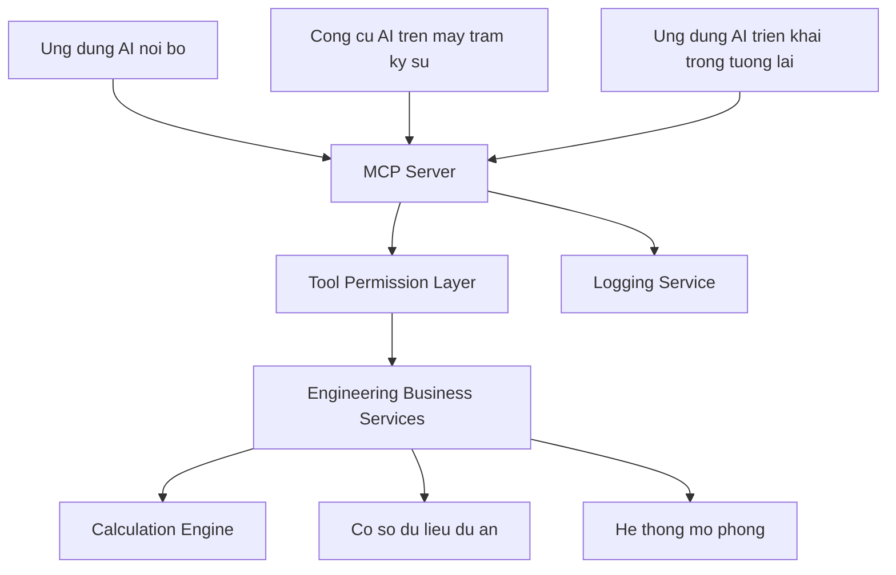

Điểm cần lưu ý trong sơ đồ: MCP Server **không kết nối trực tiếp** tới cơ sở dữ liệu hoặc hệ
thống mô phỏng. Mọi lời gọi đều đi qua tầng phân quyền và tầng dịch vụ nghiệp vụ, giống hệt
đường đi của Agent Runtime trong ứng dụng chính.

### 11.4 Nguyên tắc phân định trách nhiệm

**Yêu cầu bắt buộc: không đặt logic nghiệp vụ trong MCP Server.**

MCP Server chỉ thực hiện các nhiệm vụ sau: tiếp nhận yêu cầu theo chuẩn MCP, ánh xạ sang lời
gọi API nội bộ, chuyển tiếp kết quả, và ghi nhật ký. Toàn bộ logic tính toán, quy tắc nghiệp vụ
và ràng buộc kỹ thuật nằm trong tầng dịch vụ nghiệp vụ.

Cơ sở của yêu cầu này:

| Rủi ro nếu vi phạm | Hệ quả |
|---|---|
| Logic tồn tại ở hai nơi | Ứng dụng web và MCP cho kết quả khác nhau cho cùng một bài toán |
| Kiểm thử phân tán | Phải duy trì hai bộ kiểm thử cho cùng một quy tắc nghiệp vụ |
| Cập nhật không đồng bộ | Sửa quy tắc ở một nơi, quên nơi còn lại |
| Kiểm soát chất lượng suy giảm | Không xác định được đâu là nguồn tham chiếu chính thức của một công thức |

Trong lĩnh vực kỹ thuật, hệ quả thứ nhất là không chấp nhận được: cùng một bài toán kết cấu
không thể cho hai kết quả khác nhau tuỳ theo công cụ được sử dụng.

### 11.5 Lộ trình áp dụng MCP

MCP không được triển khai ở giai đoạn đầu. Thứ tự đề xuất:

| Giai đoạn | Trạng thái MCP | Cơ sở |
|---|---|---|
| Giai đoạn 1–2 | Chưa triển khai; tầng dịch vụ nghiệp vụ được thiết kế sẵn theo hướng độc lập với ứng dụng gọi | Ưu tiên đưa hệ thống chính vào vận hành |
| Giai đoạn 3 | Chuẩn bị: rà soát và chuẩn hoá mô tả tham số của các công cụ | Bảo đảm chất lượng mô tả trước khi công bố ra ngoài |
| Giai đoạn 4 | Triển khai MCP Server cho nhóm công cụ chỉ đọc và nhóm tính toán | Mở rộng phạm vi sử dụng với mức rủi ro thấp |

Việc thiết kế tầng dịch vụ nghiệp vụ độc lập với ứng dụng gọi cần được thực hiện **ngay từ giai
đoạn 1**, kể cả khi MCP chưa được triển khai. Đây là yêu cầu về kiến trúc, không phải yêu cầu
về tính năng: nếu tầng dịch vụ được xây dựng gắn chặt với ứng dụng web, việc bổ sung MCP về sau
sẽ phải viết lại phần lớn tầng này.

### 11.6 Giá trị mang lại

| Khía cạnh | Giá trị |
|---|---|
| Khả năng tái sử dụng | Bộ công cụ nghiệp vụ dùng được cho nhiều ứng dụng AI khác nhau |
| Khả năng mở rộng | Bổ sung ứng dụng AI mới không phát sinh chi phí tích hợp lại |
| Giảm phụ thuộc nhà cung cấp | Khi thay đổi nền tảng AI, tầng công cụ giữ nguyên |
| Kiểm soát tập trung | Mọi ứng dụng AI đều đi qua cùng một tầng phân quyền và nhật ký |

---

## 12. Kiến trúc bảo mật

### 12.1 Mục đích và phạm vi

Hệ thống lưu trữ và xử lý tài liệu kỹ thuật nội bộ, hồ sơ dự án và dữ liệu thiết kế — trong đó
một phần chịu ràng buộc bảo mật với chủ đầu tư. Kiến trúc bảo mật được thiết kế nhằm bảo đảm
ba yêu cầu: dữ liệu chỉ được truy cập bởi người có thẩm quyền; mọi hành động của hệ thống đều
được ghi nhận; và phạm vi hành động của thành phần AI được giới hạn ở mức đã được phê duyệt.

### 12.2 Nguyên tắc bảo mật

| Nguyên tắc | Nội dung áp dụng |
|---|---|
| **Thành phần AI không truy cập trực tiếp dữ liệu** | Mọi truy cập đi qua công cụ đã đăng ký và tầng phân quyền |
| **Phân quyền theo người dùng cuối** | Quyền được kiểm tra theo danh tính người dùng, không theo danh tính hệ thống |
| **Quyền tối thiểu** | Mỗi thành phần chỉ được cấp quyền đủ cho chức năng của nó |
| **Ghi nhật ký đầy đủ** | Mọi lời gọi công cụ và mọi truy xuất dữ liệu đều được ghi nhận |
| **Con người phê duyệt** | Không có hành động nào tác động tới hồ sơ chính thức được thực hiện tự động |
| **Từ chối mặc định** | Yêu cầu không xác định được quyền sẽ bị từ chối, không được cho qua |

### 12.3 Kiến trúc phân lớp kiểm soát

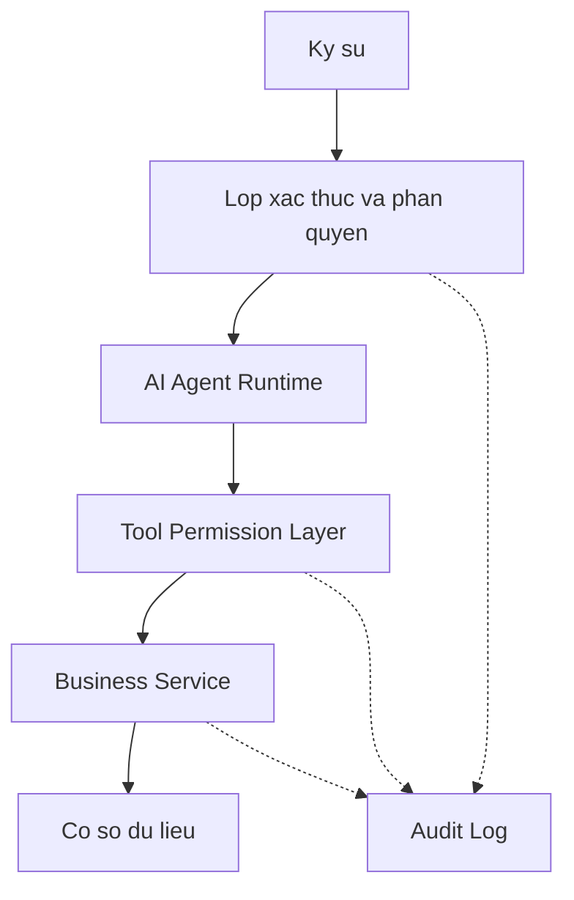

Mô tả chức năng kiểm soát tại từng lớp:

| Lớp | Nội dung kiểm soát | Rủi ro được ngăn chặn |
|---|---|---|
| Xác thực và phân quyền | Xác định danh tính, phạm vi dự án, vai trò | Truy cập trái phép vào hệ thống |
| AI Agent Runtime | Giới hạn tập công cụ khả dụng theo vai trò người dùng | Thành phần AI thực hiện hành động ngoài phạm vi thiết kế |
| Tool Permission Layer | Kiểm tra quyền theo từng lời gọi và từng đối tượng dữ liệu | Truy cập dữ liệu của dự án không thuộc thẩm quyền |
| Business Service | Xác thực tham số, áp dụng ràng buộc nghiệp vụ | Dữ liệu không hợp lệ, thao tác sai quy tắc |
| Cơ sở dữ liệu | Phân quyền ở mức tài khoản kết nối, mã hoá dữ liệu | Truy cập trực tiếp vượt cấp |

### 12.4 Mô hình phân quyền

Đề xuất áp dụng mô hình phân quyền theo vai trò kết hợp phạm vi dự án:

| Vai trò | Phạm vi dữ liệu | Nhóm công cụ được phép |
|---|---|---|
| Kỹ sư thiết kế | Các dự án được phân công | Nhóm A (chỉ đọc), Nhóm B (tính toán) |
| Chủ trì bộ môn | Toàn bộ dự án thuộc bộ môn | Nhóm A, B; quyền phê duyệt tình huống |
| Quản lý kỹ thuật | Toàn đơn vị | Nhóm A, B; quyền xem báo cáo tổng hợp |
| Quản trị hệ thống | Không truy cập nội dung hồ sơ | Quản trị người dùng, quản trị tài liệu |
| Ứng dụng AI qua MCP | Theo danh tính người dùng cuối được uỷ quyền | Theo cấu hình từng ứng dụng |

Vai trò quản trị hệ thống được thiết kế **không bao gồm quyền đọc nội dung hồ sơ dự án**. Đây
là biện pháp phân tách trách nhiệm nhằm hạn chế rủi ro từ tài khoản có đặc quyền cao.

### 12.5 Kiểm soát rủi ro đặc thù của hệ thống AI

Ngoài các biện pháp bảo mật thông thường, hệ thống có ba nhóm rủi ro đặc thù cần kiểm soát:

**Rủi ro can thiệp qua nội dung đầu vào (prompt injection).** Tài liệu hoặc dữ liệu đưa vào
ngữ cảnh xử lý có thể chứa nội dung được soạn nhằm tác động tới hành vi của thành phần AI.
Biện pháp kiểm soát: phân tách rõ giữa chỉ thị hệ thống và nội dung tài liệu trong ngữ cảnh xử
lý; giới hạn tập công cụ khả dụng; yêu cầu xác nhận của người dùng đối với mọi công cụ có tác
động ghi dữ liệu.

**Rủi ro rò rỉ dữ liệu qua ngữ cảnh xử lý.** Nội dung đưa vào ngữ cảnh có thể xuất hiện trong
câu trả lời. Biện pháp kiểm soát: lọc quyền truy cập **trước** khi đưa nội dung vào ngữ cảnh,
không lọc ở khâu hiển thị kết quả.

**Rủi ro sử dụng kết quả chưa kiểm chứng.** Người dùng có thể sử dụng đề xuất của hệ thống mà
không thực hiện kiểm chứng. Biện pháp kiểm soát: phân biệt trực quan giữa nội dung đã kiểm định
và chưa kiểm định; yêu cầu thao tác phê duyệt trước khi xuất dữ liệu phục vụ hồ sơ; ghi nhận
danh tính người phê duyệt.

### 12.6 Yêu cầu đối với nhà cung cấp dịch vụ mô hình

Trước khi triển khai, cần xác nhận bằng văn bản các nội dung sau với nhà cung cấp dịch vụ mô
hình ngôn ngữ:

| Nội dung cần xác nhận | Yêu cầu |
|---|---|
| Sử dụng dữ liệu | Dữ liệu gửi tới dịch vụ không được sử dụng để huấn luyện mô hình |
| Lưu trữ dữ liệu | Không lưu trữ nội dung yêu cầu ngoài thời gian xử lý, hoặc lưu trong phạm vi tài khoản của đơn vị |
| Vùng triển khai | Xác định vùng địa lý xử lý dữ liệu |
| Mã hoá đường truyền | Bắt buộc trên toàn bộ kết nối |
| Chứng chỉ tuân thủ | Cung cấp các chứng chỉ tuân thủ hiện có |

Nội dung này cần được rà soát cùng bộ phận pháp chế trước khi ký kết, đặc biệt trong trường hợp
hồ sơ dự án có ràng buộc bảo mật với chủ đầu tư.

---

## 13. Lộ trình triển khai

### 13.1 Nguyên tắc xây dựng lộ trình

Lộ trình được xây dựng theo bốn giai đoạn, mỗi giai đoạn đáp ứng ba điều kiện: có sản phẩm đưa
vào sử dụng được; có tiêu chí kết thúc đo lường được; và có thể dừng lại sau giai đoạn đó mà
phần đã đầu tư vẫn phát huy giá trị.

Các con số về thời lượng và nhân sự dưới đây là ước lượng ở mức đề xuất chủ trương, cần được
chuẩn xác lại trong bước lập kế hoạch chi tiết.

### 13.2 Giai đoạn 1 — Hỏi đáp tài liệu nội bộ

| Nội dung | Mô tả |
|---|---|
| **Thời lượng** | 3 tháng |
| **Mục tiêu** | Đưa vào vận hành hệ thống hỏi đáp dựa trên tài liệu nội bộ, có dẫn chứng đầy đủ |
| **Phạm vi tài liệu** | Tiêu chuẩn áp dụng, quy trình nội bộ, sổ tay kỹ thuật; ước tính 300–500 tài liệu |
| **Thành phần kỹ thuật** | Web UI cơ bản, API Gateway, RAG Service, Vector Database, tích hợp Bedrock, Conversation Log |
| **Nhân sự đề xuất** | 1 kiến trúc sư giải pháp (bán thời gian), 2 kỹ sư backend, 1 kỹ sư frontend, 1 kỹ sư dữ liệu; phía nghiệp vụ: 1 chủ trì kỹ thuật tham gia 30% thời gian |
| **Chi phí hạ tầng** | Ở mức vài trăm USD mỗi tháng cho môi trường phát triển và thử nghiệm |
| **Tiêu chí kết thúc** | Tối thiểu 20 kỹ sư sử dụng thường xuyên trong 4 tuần liên tục; tỉ lệ câu trả lời có dẫn chứng đúng đạt ngưỡng do bộ phận kỹ thuật xác định trên bộ câu hỏi kiểm tra |
| **Giá trị đạt được** | Giảm thời gian tra cứu tài liệu; hình thành số liệu nền phục vụ đánh giá các giai đoạn sau |

**Công việc bắt buộc trong giai đoạn này:** đo số liệu nền về thời gian tra cứu hiện tại, và
xây dựng bộ câu hỏi kiểm tra gồm 100–200 câu hỏi thực tế kèm đáp án do kỹ sư xác nhận. Bộ câu
hỏi này là công cụ đánh giá chất lượng cho toàn bộ các giai đoạn tiếp theo.

### 13.3 Giai đoạn 2 — Tích hợp công cụ tính toán

| Nội dung | Mô tả |
|---|---|
| **Thời lượng** | 3–4 tháng |
| **Mục tiêu** | Hệ thống thực hiện được các phép kiểm tra kỹ thuật thông qua công cụ đã chuẩn hoá |
| **Phạm vi công cụ** | 3–5 công cụ được lựa chọn theo tần suất sử dụng thực tế |
| **Thành phần kỹ thuật** | Agent Runtime, Tool Registry, Tool Executor, Tool Permission Layer, Calculation Engine, Tool Execution Log |
| **Nhân sự đề xuất** | Giữ nguyên đội giai đoạn 1, bổ sung 1 kỹ sư phát triển module tính toán; phía nghiệp vụ: 1 kỹ sư kết cấu tham gia 50% thời gian để xác nhận logic tính toán |
| **Tiêu chí kết thúc** | Tối thiểu 3 công cụ vận hành ổn định; kết quả tính toán khớp với kết quả tính tay đã được xác nhận trên toàn bộ bộ ca kiểm thử |
| **Giá trị đạt được** | Chuẩn hoá công cụ tính toán trong đơn vị; kết quả có khả năng tái lập và truy vết |

**Rủi ro chính của giai đoạn:** việc chuyển các bảng tính hiện có thành module tính toán chuẩn
hoá thường phát hiện ra sai lệch giữa các phiên bản đang lưu hành. Cần dự trù thời gian cho
việc rà soát và thống nhất công thức — đây là công việc nghiệp vụ, không phải công việc lập
trình.

### 13.4 Giai đoạn 3 — Hệ thống tri thức tình huống kỹ thuật

| Nội dung | Mô tả |
|---|---|
| **Thời lượng** | 4–5 tháng |
| **Mục tiêu** | Hình thành kho tri thức tình huống và đưa cơ chế tra cứu tiền lệ vào vận hành |
| **Thành phần kỹ thuật** | Case Knowledge Service, cơ chế ghi nhận trong luồng, cơ chế tra cứu tương tự, Engineering Case Log, giao diện phê duyệt |
| **Nhân sự đề xuất** | Đội kỹ thuật giai đoạn 2; phía nghiệp vụ: nhóm 3–5 kỹ sư tham gia số hoá tình huống lịch sử theo đợt |
| **Tiêu chí kết thúc** | Tối thiểu 300 tình huống ở trạng thái đã phê duyệt; tỉ lệ câu hỏi được giải quyết có tham chiếu tiền lệ đạt mức do bộ phận kỹ thuật xác định |
| **Giá trị đạt được** | Hình thành tài sản tri thức thuộc sở hữu đơn vị; tăng tính nhất quán trong thiết kế |

**Điều kiện tiên quyết:** giai đoạn này chỉ nên triển khai khi giai đoạn 2 đã vận hành ổn định,
vì bản ghi tình huống phụ thuộc vào kết quả kiểm định do công cụ tính toán tạo ra. Triển khai
trước sẽ tạo ra các bản ghi thiếu trường `verification`, không sử dụng được làm tiền lệ.

### 13.5 Giai đoạn 4 — Mở rộng hệ sinh thái công cụ

| Nội dung | Mô tả |
|---|---|
| **Thời lượng** | 3 tháng |
| **Mục tiêu** | Công bố bộ công cụ nghiệp vụ theo chuẩn MCP; mở rộng phạm vi ứng dụng |
| **Thành phần kỹ thuật** | MCP Server, chuẩn hoá mô tả công cụ, cơ chế phân quyền cho ứng dụng bên ngoài |
| **Nhân sự đề xuất** | 2 kỹ sư backend, 1 kỹ sư vận hành |
| **Tiêu chí kết thúc** | Bộ công cụ được sử dụng bởi tối thiểu 2 ứng dụng AI khác nhau; nhật ký ghi nhận đầy đủ các lời gọi qua MCP |
| **Giá trị đạt được** | Bảo toàn giá trị đầu tư; giảm chi phí cho các sáng kiến ứng dụng AI tiếp theo |

### 13.6 Tổng hợp lộ trình

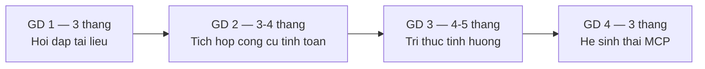

| Giai đoạn | Thời lượng | Nhân sự kỹ thuật | Sự tham gia của bộ phận nghiệp vụ | Điều kiện chuyển giai đoạn |
|---|---|---|---|---|
| GĐ 1 | 3 tháng | 4–5 người | 1 chủ trì kỹ thuật, 30% thời gian | Đạt mức sử dụng và chất lượng đề ra |
| GĐ 2 | 3–4 tháng | 5–6 người | 1 kỹ sư kết cấu, 50% thời gian | Công cụ tính toán được xác nhận đúng |
| GĐ 3 | 4–5 tháng | 5–6 người | Nhóm 3–5 kỹ sư theo đợt | Đạt số lượng tình huống tối thiểu |
| GĐ 4 | 3 tháng | 3 người | Không đáng kể | Bộ công cụ được tái sử dụng |

**Tổng thời gian dự kiến:** 13–15 tháng cho toàn bộ bốn giai đoạn.

Cần lưu ý rằng mức độ tham gia của bộ phận nghiệp vụ là yếu tố quyết định thành công, và đây là
nguồn lực khó bố trí nhất. Nếu không bảo đảm được thời gian tham gia của kỹ sư chuyên môn theo
mức đề xuất, cần điều chỉnh thời lượng giai đoạn tương ứng thay vì giữ nguyên tiến độ.

---

## 14. Rủi ro và biện pháp kiểm soát

### 14.1 Bảng tổng hợp rủi ro

| Mã | Rủi ro | Mức độ | Khả năng xảy ra | Biện pháp kiểm soát chính |
|---|---|---|---|---|
| RR-01 | Hệ thống đưa ra thông tin sai hoặc không có căn cứ | Cao | Trung bình | RAG bắt buộc dẫn chứng; kết quả tính toán do công cụ tạo ra; kỹ sư phê duyệt |
| RR-02 | Chất lượng tài liệu đầu vào không bảo đảm | Cao | Cao | Rà soát và phân loại tài liệu trước khi đưa vào hệ thống; quản lý hiệu lực tài liệu |
| RR-03 | Dữ liệu tình huống không được ghi nhận đủ | Cao | Cao | Ghi nhận trong luồng công việc; bản ghi có giá trị sử dụng ngay cho kỹ sư |
| RR-04 | Rò rỉ dữ liệu dự án | Cao | Thấp | Phân quyền theo người dùng cuối; lọc quyền trước khi đưa vào ngữ cảnh; nhật ký đầy đủ |
| RR-05 | Người dùng không tiếp nhận hệ thống | Cao | Trung bình | Triển khai theo giai đoạn; bắt đầu từ nhóm bài toán có giá trị rõ ràng; đo mức sử dụng thực tế |
| RR-06 | Chi phí vận hành vượt dự kiến | Trung bình | Trung bình | Kiểm soát ngân sách theo phiên; theo dõi chi phí theo tháng; đặt ngưỡng cảnh báo |
| RR-07 | Phụ thuộc vào một nhà cung cấp dịch vụ mô hình | Trung bình | Trung bình | Tách lớp trừu tượng khi gọi mô hình; tầng công cụ độc lập với nền tảng AI |
| RR-08 | Thiếu nguồn lực nghiệp vụ tham gia | Cao | Cao | Xác định cam kết nhân sự ngay từ bước phê duyệt chủ trương |
| RR-09 | Kết quả tính toán không nhất quán giữa các nguồn | Cao | Trung bình | Một nguồn logic duy nhất; MCP không chứa logic nghiệp vụ; kiểm thử đối chiếu |
| RR-10 | Thay đổi tiêu chuẩn áp dụng làm sai lệch tri thức đã lưu | Trung bình | Cao | Quản lý vòng đời tài liệu và tình huống theo hiệu lực tiêu chuẩn |

### 14.2 Phân tích các rủi ro trọng yếu

#### RR-01 — Thông tin sai hoặc không có căn cứ

**Bản chất rủi ro:** mô hình ngôn ngữ có khả năng tạo ra nội dung trôi chảy nhưng không chính
xác (hallucination). Trong lĩnh vực kỹ thuật, một thông số sai được đưa vào hồ sơ có hậu quả
nghiêm trọng.

**Biện pháp kiểm soát theo lớp:**

| Lớp kiểm soát | Nội dung |
|---|---|
| Lớp 1 — Ràng buộc nguồn | Hệ thống chỉ trả lời dựa trên đoạn tài liệu đã truy xuất; không sử dụng tri thức chung của mô hình cho nội dung kỹ thuật |
| Lớp 2 — Ngưỡng độ tin cậy | Khi không tìm được tài liệu đủ liên quan, hệ thống trả lời không đủ căn cứ thay vì suy đoán |
| Lớp 3 — Không tự tính toán | Mọi số liệu kỹ thuật đến từ công cụ tính toán, không do mô hình sinh ra |
| Lớp 4 — Dẫn chứng bắt buộc | Mỗi nội dung đều kèm nguồn để kỹ sư kiểm chứng |
| Lớp 5 — Phê duyệt của con người | Không có nội dung nào vào hồ sơ mà không qua phê duyệt |

**Rủi ro còn lại sau kiểm soát:** vẫn tồn tại khả năng hệ thống diễn giải sai một điều khoản đã
trích dẫn đúng. Biện pháp cuối cùng là hiển thị nguyên văn đoạn trích dẫn để kỹ sư đối chiếu
trực tiếp, không chỉ hiển thị phần diễn giải.

#### RR-02 — Chất lượng tài liệu đầu vào

**Bản chất rủi ro:** hệ thống phản ánh đúng nội dung tài liệu được cung cấp. Nếu kho tài liệu
chứa bản lỗi thời, bản nháp hoặc nội dung mâu thuẫn, hệ thống sẽ trả lời theo các nội dung đó.

**Biện pháp kiểm soát:**

1. Xác định chủ sở hữu cho từng nhóm tài liệu; chỉ tài liệu có chủ sở hữu xác nhận mới được
   đưa vào hệ thống.
2. Quản lý trạng thái hiệu lực: tài liệu hết hiệu lực được đánh dấu, không xoá.
3. Khi phát hiện mâu thuẫn giữa các nguồn, hệ thống trình bày cả hai nguồn kèm cảnh báo thay
   vì tự lựa chọn.
4. Rà soát định kỳ danh sách tài liệu được truy xuất nhiều nhưng nhận phản hồi tiêu cực.

**Lưu ý về phạm vi trách nhiệm:** việc rà soát chất lượng tài liệu là công việc của bộ phận kỹ
thuật, không thuộc phạm vi của dự án phần mềm. Cần xác định rõ nội dung này ngay từ bước phê
duyệt chủ trương.

#### RR-03 — Dữ liệu tình huống không được ghi nhận đủ

**Bản chất rủi ro:** đây là rủi ro có khả năng xảy ra cao nhất trong toàn bộ phương án. Các hệ
thống quản lý tri thức thất bại chủ yếu do dữ liệu không được đóng góp, không do hạn chế kỹ
thuật.

**Biện pháp kiểm soát:** đã trình bày tại Mục 7.8. Bổ sung ba biện pháp về mặt tổ chức:

1. Đưa chỉ tiêu số lượng tình huống được ghi nhận vào đánh giá công việc của bộ môn, không của
   cá nhân, nhằm tránh tạo động cơ ghi nhận hình thức.
2. Định kỳ công bố các tình huống được tham chiếu nhiều nhất, ghi nhận đóng góp của người phê
   duyệt.
3. Theo dõi chỉ số tỉ lệ câu hỏi được giải quyết bằng tiền lệ; đây là chỉ số phản ánh trực tiếp
   giá trị của kho tri thức.

#### RR-05 — Người dùng không tiếp nhận hệ thống

**Bản chất rủi ro:** hệ thống được xây dựng đầy đủ tính năng nhưng kỹ sư tiếp tục làm việc theo
cách cũ.

**Nguyên nhân thường gặp:**

| Nguyên nhân | Biện pháp phòng ngừa |
|---|---|
| Chất lượng trả lời không ổn định ở giai đoạn đầu | Giới hạn phạm vi ban đầu ở nhóm tài liệu có chất lượng cao |
| Thời gian phản hồi chậm | Đặt yêu cầu phi chức năng rõ ràng ngay từ giai đoạn 1 |
| Kết quả không dùng được trực tiếp cho hồ sơ | Bổ sung chức năng xuất dữ liệu phục vụ hồ sơ ngay từ giai đoạn 1 |
| Không được đào tạo sử dụng | Tổ chức hướng dẫn theo bộ môn, sử dụng chính các câu hỏi thực tế của bộ môn đó |
| Lo ngại về vai trò công việc | Truyền thông rõ về nguyên tắc hệ thống hỗ trợ, không thay thế; nhấn mạnh vai trò phê duyệt của kỹ sư |

Nguyên nhân cuối cùng cần được xử lý ở cấp lãnh đạo. Thông điệp cần nhất quán: hệ thống ghi
nhận và làm nổi bật giá trị chuyên môn của kỹ sư, không làm giảm vai trò đó.

#### RR-06 — Chi phí vận hành

**Bản chất rủi ro:** chi phí dịch vụ mô hình ngôn ngữ tính theo khối lượng xử lý. Thiết kế
không kiểm soát có thể dẫn tới chi phí tăng nhanh khi số người dùng tăng.

**Biện pháp kiểm soát:** giới hạn số vòng lặp và khối lượng xử lý theo phiên; chọn lọc nội dung
đưa vào ngữ cảnh; áp dụng cơ chế lưu kết quả cho các câu hỏi lặp lại; theo dõi chi phí theo bộ
phận và đặt ngưỡng cảnh báo.

Đề xuất bổ sung: xây dựng báo cáo chi phí theo tháng với đơn vị đo là **chi phí trung bình cho
một câu hỏi**. Chỉ số này cho phép so sánh trực tiếp với chi phí thời gian tra cứu thủ công,
phục vụ đánh giá hiệu quả đầu tư.

### 14.3 Các nội dung cần quyết định ở cấp lãnh đạo

| Nội dung | Yêu cầu quyết định |
|---|---|
| Phạm vi dữ liệu đưa vào hệ thống | Xác định nhóm hồ sơ dự án được phép sử dụng, sau rà soát ràng buộc bảo mật |
| Nguồn lực nghiệp vụ | Cam kết thời gian tham gia của kỹ sư chuyên môn theo từng giai đoạn |
| Chủ sở hữu nghiệp vụ của hệ thống | Chỉ định một lãnh đạo bộ phận kỹ thuật chịu trách nhiệm về nội dung |
| Chính sách sử dụng kết quả | Ban hành quy định về việc sử dụng kết quả từ hệ thống trong hồ sơ |
| Ngân sách vận hành | Phê duyệt ngưỡng chi phí vận hành hằng năm |

---

## 15. Định hướng phát triển

### 15.1 Nguyên tắc

Các nội dung trong mục này là định hướng dài hạn, không thuộc phạm vi phê duyệt lần này. Mục
đích trình bày là để bảo đảm các quyết định kiến trúc hiện tại không tạo ra rào cản cho các
bước phát triển tiếp theo.

Mỗi định hướng dưới đây chỉ khả thi khi các giai đoạn trước đã hoàn thành và dữ liệu đã tích
luỹ đủ. Không đề xuất triển khai sớm.

### 15.2 Các định hướng mở rộng

**Trợ lý kỹ thuật tích hợp trong công cụ thiết kế.** Đưa năng lực tra cứu và kiểm định vào
trực tiếp môi trường làm việc của kỹ sư, thay vì yêu cầu chuyển sang ứng dụng riêng. Điều kiện:
bộ công cụ đã được chuẩn hoá theo MCP (giai đoạn 4).

**Kiểm tra hồ sơ thiết kế tự động.** Hệ thống rà soát hồ sơ trước khi nộp thẩm tra và cảnh báo
các nội dung có nguy cơ bị góp ý, dựa trên dữ liệu biên bản thẩm tra đã tích luỹ. Điều kiện:
kho tình huống có đủ dữ liệu về kết quả thẩm tra.

**Đồ thị tri thức kỹ thuật (knowledge graph).** Biểu diễn quan hệ giữa cấu kiện, tiêu chuẩn,
bài toán và phương án dưới dạng đồ thị, cho phép truy vấn theo quan hệ mà tìm kiếm theo ngữ
nghĩa không đáp ứng được. Điều kiện: dữ liệu tình huống đủ lớn và đã được chuẩn hoá.

**Phối hợp nhiều tác tử chuyên biệt (multi-agent).** Phân chia thành các tác tử theo chuyên
môn — kết cấu, nền móng, kiểm tra hồ sơ — phối hợp xử lý các bài toán liên bộ môn. Điều kiện:
hệ thống một tác tử đã vận hành ổn định và đã xác định rõ ranh giới trách nhiệm.

**Tự động hoá một phần quy trình thiết kế.** Áp dụng cho các hạng mục có tính lặp cao và có
tiêu chí kiểm tra rõ ràng. Điều kiện: đã có đủ dữ liệu tiền lệ và cơ chế kiểm định tự động
đáng tin cậy. Nguyên tắc phê duyệt của con người vẫn được giữ nguyên trong mọi trường hợp.

**Phân tích dữ liệu thiết kế phục vụ quản trị.** Khai thác kho tình huống để phân tích xu hướng
thiết kế, chi phí vật liệu theo phương án, và hiệu quả của các lựa chọn kỹ thuật khác nhau.
Đây là nhóm giá trị chưa được đề cập trong các mục trước nhưng có ý nghĩa với công tác quản lý.

### 15.3 Điều kiện bảo đảm khả năng mở rộng

Ba quyết định kiến trúc trong phương án hiện tại là điều kiện cần cho các định hướng trên:

| Quyết định | Vai trò đối với mở rộng |
|---|---|
| Tầng dịch vụ nghiệp vụ độc lập với ứng dụng gọi (AD-05) | Cho phép bổ sung ứng dụng mới mà không sửa logic nghiệp vụ |
| Dữ liệu tình huống có cấu trúc (AD-03) | Là điều kiện bắt buộc cho đồ thị tri thức và phân tích dữ liệu |
| Nhật ký đầy đủ ba nhóm (Mục 8) | Là nguồn dữ liệu cho mọi hoạt động phân tích và cải thiện về sau |

Nếu một trong ba quyết định này bị bỏ qua nhằm rút ngắn tiến độ giai đoạn đầu, phần lớn các
định hướng tại Mục 15.2 sẽ đòi hỏi xây dựng lại từ đầu.

---

## 16. Phụ lục

### 16.1 Thuật ngữ

| Thuật ngữ | Giải thích |
|---|---|
| Agent Runtime | Thành phần điều phối trung tâm, tiếp nhận yêu cầu và điều phối việc gọi công cụ |
| Chunking | Quá trình cắt tài liệu thành các đoạn nhỏ phục vụ truy xuất |
| Embedding | Biểu diễn số học của văn bản, phục vụ tìm kiếm theo ngữ nghĩa |
| Hallucination | Hiện tượng mô hình sinh ra nội dung không chính xác nhưng trình bày trôi chảy |
| LLM | Mô hình ngôn ngữ lớn (Large Language Model) |
| MCP | Giao thức kết nối công cụ AI (Model Context Protocol) |
| Prompt injection | Kỹ thuật can thiệp hành vi hệ thống AI thông qua nội dung đầu vào |
| RAG | Truy xuất tăng cường sinh nội dung (Retrieval Augmented Generation) |
| RPO / RTO | Điểm khôi phục mục tiêu / Thời gian khôi phục mục tiêu |
| Tool Calling | Cơ chế cho phép hệ thống AI gọi các chức năng phần mềm đã định nghĩa |
| Vector database | Cơ sở dữ liệu chuyên dụng lưu trữ embedding |

### 16.2 Danh mục quyết định kiến trúc

| Mã | Nội dung quyết định | Mục tham chiếu |
|---|---|---|
| AD-01 | Sử dụng RAG thay vì huấn luyện lại mô hình | 0.4, 6 |
| AD-02 | Thành phần AI không truy cập trực tiếp dữ liệu | 0.4, 5.4, 12 |
| AD-03 | Tri thức tình huống lưu ở dạng có cấu trúc | 0.4, 7 |
| AD-04 | Phê duyệt của con người là bước bắt buộc | 0.4, 7.5, 9.2 |
| AD-05 | MCP là tầng tích hợp, không chứa logic nghiệp vụ | 0.4, 11.4 |
| AD-06 | Triển khai theo giai đoạn có giá trị độc lập | 0.4, 13 |
| AD-07 | pgvector giai đoạn đầu, OpenSearch khi mở rộng | 0.4, 10.3 |
| AD-08 | Ưu tiên độ tin cậy hơn độ bao phủ | 0.4, 5.7, 6.4 |

### 16.3 Danh mục công cụ dự kiến triển khai

| Mã công cụ | Chức năng | Nhóm rủi ro | Giai đoạn |
|---|---|---|---|
| `doc.search` | Tra cứu tài liệu nội bộ | A — chỉ đọc | GĐ 1 |
| `project.element.get` | Truy vấn thông số cấu kiện | A — chỉ đọc | GĐ 2 |
| `case.search_similar` | Tra cứu tình huống tương tự | A — chỉ đọc | GĐ 3 |
| `calc.beam.flexure` | Kiểm tra khả năng chịu uốn của dầm | B — tính toán | GĐ 2 |
| `calc.beam.shear` | Kiểm tra khả năng chịu cắt của dầm | B — tính toán | GĐ 2 |
| `calc.beam.deflection` | Kiểm tra độ võng | B — tính toán | GĐ 2 |
| `calc.column.capacity` | Kiểm tra khả năng chịu lực của cột | B — tính toán | GĐ 3 |
| `case.create` | Ghi nhận tình huống kỹ thuật | C — ghi dữ liệu | GĐ 3 |

Danh mục này là dự kiến ở mức đề xuất chủ trương. Danh mục chính thức được xác định trong bước
lập kế hoạch chi tiết, trên cơ sở khảo sát tần suất sử dụng thực tế của từng bộ môn.

### 16.4 Nội dung trình phê duyệt

Đề nghị Ban lãnh đạo xem xét và cho ý kiến về các nội dung sau:

1. Phê duyệt chủ trương triển khai hệ thống AI Engineering Assistant theo phương án kiến trúc
   trình bày tại tài liệu này.
2. Phê duyệt triển khai giai đoạn 1 với thời lượng 3 tháng và phạm vi nêu tại Mục 13.2.
3. Chỉ định chủ sở hữu nghiệp vụ của hệ thống thuộc bộ phận kỹ thuật.
4. Phê duyệt cam kết nguồn lực nghiệp vụ tham gia theo mức đề xuất tại Mục 13.6.
5. Giao bộ phận kỹ thuật rà soát và bàn giao danh mục tài liệu phục vụ giai đoạn 1.
6. Giao bộ phận pháp chế rà soát các nội dung nêu tại Mục 12.6 trước khi ký kết dịch vụ.

---

*Kết thúc tài liệu.*
