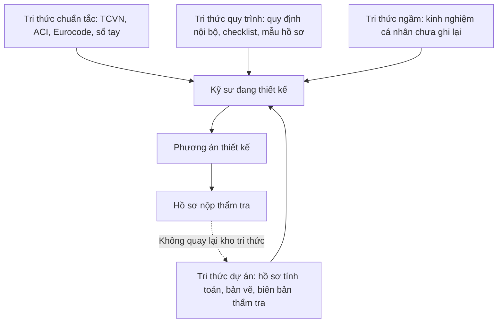

# Đề xuất kiến trúc hệ thống AI Engineering Assistant

**Sử dụng Large Language Model, RAG, Tool Calling và MCP**

| | |
|---|---|
| **Loại tài liệu** | Đề xuất kiến trúc giải pháp (Solution Architecture Proposal) |
| **Phiên bản** | 1.0 |
| **Ngày phát hành** | 06/09/2026 |
| **Người soạn** | Bộ phận Kiến trúc giải pháp |
| **Đối tượng đọc** | Ban Giám đốc, CTO, Trưởng phòng Kỹ thuật, Trưởng bộ phận Thiết kế |
| **Mức độ mật** | Nội bộ — Hạn chế |
| **Trạng thái** | Trình phê duyệt chủ trương |

---

## Mục lục

- [0. Giả định, phạm vi và quyết định kiến trúc](#0-giả-định-phạm-vi-và-quyết-định-kiến-trúc)
- [1. Tóm tắt dành cho lãnh đạo](#1-tóm-tắt-dành-cho-lãnh-đạo)
- [2. Hiện trạng, vấn đề và cơ hội](#2-hiện-trạng-vấn-đề-và-cơ-hội)
- [3. Tổng quan giải pháp đề xuất](#3-tổng-quan-giải-pháp-đề-xuất)
- [4. Kiến trúc hệ thống tổng thể](#4-kiến-trúc-hệ-thống-tổng-thể)
- [5. Kiến trúc AI Agent](#5-kiến-trúc-ai-agent)
- [6. Kiến trúc RAG](#6-kiến-trúc-rag)
- [7. Hệ thống tri thức tình huống kỹ thuật](#7-hệ-thống-tri-thức-tình-huống-kỹ-thuật)
- [8. Kiến trúc dữ liệu và nhật ký](#8-kiến-trúc-dữ-liệu-và-nhật-ký)
- [9. Kiến trúc giao diện người dùng](#9-kiến-trúc-giao-diện-người-dùng)
- [10. Đề xuất technology stack](#10-đề-xuất-technology-stack)
- [11. Kiến trúc MCP](#11-kiến-trúc-mcp)
- [12. Kiến trúc bảo mật](#12-kiến-trúc-bảo-mật)
- [13. Lộ trình triển khai](#13-lộ-trình-triển-khai)
- [14. Rủi ro và biện pháp kiểm soát](#14-rủi-ro-và-biện-pháp-kiểm-soát)
- [15. Tầm nhìn mở rộng](#15-tầm-nhìn-mở-rộng)
- [16. Phụ lục](#16-phụ-lục)

---

## 0. Giả định, phạm vi và quyết định kiến trúc

Phần này được đặt trước nội dung chính theo đúng nguyên tắc của một tài liệu kiến trúc: người
đọc cần biết tài liệu dựa trên những giả định nào trước khi đánh giá các đề xuất bên trong.
Nếu một giả định sai, phần kiến trúc phụ thuộc vào nó phải được xem xét lại — chứ không phải
toàn bộ tài liệu bị bác bỏ.

### 0.1 Phạm vi tài liệu

Tài liệu này đề xuất **kiến trúc giải pháp** cho một hệ thống trợ lý kỹ thuật nội bộ. Nội dung
bao gồm: phân tích hiện trạng, mô hình giải pháp, kiến trúc thành phần, mô hình dữ liệu, lộ
trình triển khai theo giai đoạn, phân tích rủi ro và định hướng mở rộng.

Tài liệu **không** bao gồm: dự toán chi phí chi tiết theo từng hạng mục, hồ sơ mua sắm hạ
tầng, thiết kế chi tiết cấp module, và kế hoạch nhân sự chính thức. Những nội dung đó thuộc
bước tiếp theo, sau khi chủ trương được phê duyệt.

### 0.2 Nguyên tắc dùng thuật ngữ

Tài liệu hướng tới người đọc không chuyên về AI. Vì vậy các thuật ngữ tiếng Anh được giữ
nguyên — do đây là tên gọi chuẩn trong ngành, dịch ra sẽ gây khó tra cứu về sau — nhưng **luôn
kèm một dòng giải thích bằng tiếng Việt ở lần xuất hiện đầu tiên**, và sau đó dùng nhất quán:

| Thuật ngữ giữ nguyên | Giải thích ngắn |
|---|---|
| LLM (Large Language Model) | Mô hình ngôn ngữ lớn — phần mềm đọc hiểu và sinh văn bản tự nhiên |
| RAG (Retrieval Augmented Generation) | Cơ chế bắt AI đọc tài liệu công ty trước khi trả lời |
| Tool Calling | Cơ chế cho phép AI gọi một chức năng phần mềm có sẵn thay vì tự suy đoán kết quả |
| MCP (Model Context Protocol) | Chuẩn giao tiếp để nhiều phần mềm AI khác nhau cùng dùng chung một bộ tool |
| Agent | Thành phần điều phối: nhận yêu cầu, quyết định các bước cần làm, gọi tool, tổng hợp kết quả |
| Embedding | Biểu diễn số học của một đoạn văn bản, dùng để tìm đoạn có nội dung gần nghĩa |
| Vector database | Kho lưu trữ chuyên cho embedding, phục vụ tìm kiếm theo ngữ nghĩa |
| Hallucination | Hiện tượng AI trả lời trôi chảy nhưng nội dung sai hoặc bịa đặt |

Các khái niệm nghiệp vụ dùng tiếng Việt thống nhất: *truy xuất* (retrieval), *dẫn chứng*
(evidence/citation), *kiểm định* (verification), *phê duyệt* (approval), *tình huống kỹ thuật*
(engineering case), *nhật ký* (log).

### 0.3 Giả định chính

| # | Giả định | Ảnh hưởng nếu giả định sai |
|---|---|---|
| GĐ-01 | Công ty hoạt động trong lĩnh vực tư vấn thiết kế kết cấu và xây dựng — công việc chính là thiết kế, tính toán, kiểm định và lập hồ sơ kết cấu bê tông cốt thép và kết cấu thép. | Toàn bộ ví dụ trong tài liệu cần thay bằng ví dụ đúng ngành; phần kiến trúc kỹ thuật giữ nguyên. |
| GĐ-02 | Tài liệu kỹ thuật nội bộ hiện phân tán trên file server, email, ổ đĩa cá nhân và thư mục dự án; định dạng chủ yếu là PDF, DOCX, XLSX và bản vẽ DWG/PDF. | Nếu công ty đã có hệ thống quản lý tài liệu tập trung, giai đoạn 1 rút ngắn đáng kể vì bước thu thập dữ liệu đã hoàn tất. |
| GĐ-03 | Công ty đã có một số công cụ tính toán: bảng tính Excel có công thức, phần mềm phân tích kết cấu thương mại (ETABS, SAP2000, SAFE), và có thể có một vài script riêng. | Nếu chưa có công cụ nào gọi được tự động, giai đoạn 2 phải bao gồm việc xây dựng calculation service từ đầu, kéo dài thêm khoảng 2–3 tháng. |
| GĐ-04 | Công ty chấp nhận dùng dịch vụ mô hình ngôn ngữ trên cloud trong phạm vi một tài khoản AWS do công ty kiểm soát, với cam kết dữ liệu không được dùng để huấn luyện mô hình. | Nếu bắt buộc chạy on-premise, cần thay bằng mô hình mã nguồn mở tự vận hành; chi phí hạ tầng tăng và chất lượng trả lời giảm. |
| GĐ-05 | Hồ sơ dự án đã nghiệm thu có thể dùng làm dữ liệu nội bộ, sau khi rà soát ràng buộc bảo mật với chủ đầu tư. | Nếu phần lớn hồ sơ bị ràng buộc bảo mật, tập dữ liệu ban đầu thu hẹp; cần ưu tiên tiêu chuẩn và quy trình nội bộ trước. |
| GĐ-06 | Kỹ sư sẵn sàng ghi nhận lại quyết định kỹ thuật dưới dạng có cấu trúc, nếu thao tác mất dưới 2 phút và mang lại lợi ích thấy được. | Đây là giả định rủi ro nhất. Nếu sai, tầng tri thức tình huống ở Mục 7 không có dữ liệu và hệ thống chỉ dừng ở mức tra cứu tài liệu. |
| GĐ-07 | Công ty có ít nhất một kỹ sư phần mềm nội bộ hoặc đối tác kỹ thuật đủ năng lực vận hành hệ thống trên AWS. | Nếu không, cần bổ sung chi phí thuê ngoài vận hành dài hạn vào bài toán tài chính. |
| GĐ-08 | Mọi kết quả do AI đề xuất đều phải được kỹ sư có thẩm quyền phê duyệt trước khi đưa vào hồ sơ chính thức. | Đây là ràng buộc pháp lý và trách nhiệm nghề nghiệp, không phải lựa chọn thiết kế. Không được nới lỏng trong bất kỳ giai đoạn nào. |

Tài liệu sẽ chính xác hơn nếu có thêm ba đầu vào: danh mục tài liệu kỹ thuật hiện có, mô tả hệ
thống phần mềm đang vận hành, và sơ đồ quy trình thiết kế thực tế. Khi có các dữ liệu đó, các
Mục 2, 6, 7 và 13 nên được hiệu chỉnh theo số liệu thật của công ty.

### 0.4 Quyết định kiến trúc

Mỗi quyết định được trình bày theo cấu trúc: **quyết định — phương án đã cân nhắc — lý do lựa
chọn**. Đây là những lựa chọn ảnh hưởng dài hạn, khó đảo ngược, cần sự đồng thuận của lãnh đạo
trước khi triển khai.

**AD-01 — Dùng RAG thay vì huấn luyện lại mô hình trên dữ liệu công ty**

*Phương án cân nhắc:* (a) fine-tune một mô hình riêng trên toàn bộ hồ sơ công ty; (b) RAG —
giữ mô hình nguyên trạng, nạp tài liệu liên quan vào ngữ cảnh ở mỗi câu hỏi; (c) kết hợp cả hai.

*Lựa chọn:* phương án (b) cho toàn bộ giai đoạn 1–3.

*Lý do:* Fine-tuning không cho phép trích dẫn nguồn — mô hình "nhớ" nội dung nhưng không chỉ
ra được câu trả lời đến từ trang nào của tài liệu nào. Trong ngành kỹ thuật, một câu trả lời
không có dẫn chứng là câu trả lời không dùng được. RAG còn cho phép cập nhật tức thì: sửa một
tiêu chuẩn thì hệ thống trả lời theo bản mới ngay, không cần huấn luyện lại. Chi phí thấp hơn
một bậc và rủi ro kỹ thuật thấp hơn nhiều.

**AD-02 — AI không bao giờ truy cập trực tiếp cơ sở dữ liệu hoặc hệ thống nghiệp vụ**

*Phương án cân nhắc:* (a) cấp cho AI quyền sinh và chạy câu lệnh SQL trực tiếp; (b) AI chỉ
được gọi các tool định nghĩa sẵn, mỗi tool là một API nghiệp vụ có kiểm soát quyền.

*Lựa chọn:* phương án (b), không có ngoại lệ.

*Lý do:* Mô hình ngôn ngữ sinh văn bản theo xác suất; nếu cho phép nó sinh câu lệnh chạy trực
tiếp trên cơ sở dữ liệu thì mọi lỗi sinh văn bản đều có thể trở thành sự cố dữ liệu. Khi AI
chỉ được gọi tool, mỗi tool là một điểm kiểm soát: xác thực tham số, kiểm tra quyền, ghi nhật
ký, giới hạn phạm vi. Chi tiết ở Mục 5.3 và Mục 12.

**AD-03 — Tri thức tình huống lưu ở dạng có cấu trúc, không chỉ ở dạng văn bản**

*Phương án cân nhắc:* (a) lưu toàn bộ lịch sử hội thoại dưới dạng văn bản rồi để RAG tìm; (b)
xây riêng một mô hình dữ liệu tình huống kỹ thuật với các trường bắt buộc.

*Lựa chọn:* phương án (b) — trọng tâm của Mục 7.

*Lý do:* Một câu văn "dầm này nên tăng thép lên 8D25" không cho phép hệ thống lọc theo nhịp
dầm, cấp bê tông hay tải trọng. Dữ liệu có cấu trúc cho phép truy vấn chính xác, kiểm tra tính
hợp lệ, thống kê, và về lâu dài là phân tích xu hướng thiết kế. Đây chính là khác biệt giữa
một chatbot và một tài sản tri thức của doanh nghiệp.

**AD-04 — Con người phê duyệt là bước bắt buộc trong luồng, không phải tuỳ chọn**

*Phương án cân nhắc:* (a) AI đề xuất, kỹ sư tuỳ ý xem hoặc bỏ qua; (b) mọi kết quả đưa vào hồ
sơ đều phải qua thao tác phê duyệt có ghi nhận danh tính và thời điểm.

*Lựa chọn:* phương án (b).

*Lý do:* Trách nhiệm kỹ thuật thuộc về kỹ sư ký hồ sơ, không thuộc về phần mềm. Hệ thống phải
phản ánh đúng thực tế đó. Ngoài ra, chính thao tác phê duyệt là nguồn dữ liệu quý nhất: nó cho
biết đề xuất nào đúng, đề xuất nào bị bác, và vì sao.

**AD-05 — MCP là tầng tích hợp, không chứa logic nghiệp vụ**

*Phương án cân nhắc:* (a) viết logic tính toán ngay trong MCP server cho nhanh; (b) MCP server
chỉ là lớp vỏ mỏng, gọi xuống business service dùng chung.

*Lựa chọn:* phương án (b).

*Lý do:* Nếu logic nằm trong MCP server, công ty sẽ có hai bản logic tính toán khác nhau — một
cho ứng dụng web, một cho MCP — và theo thời gian chúng sẽ lệch nhau. Khi đó cùng một bài toán
cho hai kết quả, là tình huống không chấp nhận được trong hồ sơ kỹ thuật. Chi tiết ở Mục 11.

**AD-06 — Xây dựng theo giai đoạn có giá trị độc lập, không xây trọn gói một lần**

*Phương án cân nhắc:* (a) triển khai toàn bộ tính năng trong một dự án 12 tháng; (b) bốn giai
đoạn, mỗi giai đoạn tự nó đã mang lại giá trị sử dụng được.

*Lựa chọn:* phương án (b).

*Lý do:* Giai đoạn 1 — hỏi đáp tài liệu — đưa vào sử dụng được sau khoảng 3 tháng và tự nó đã
tiết kiệm thời gian tra cứu. Nếu giai đoạn 1 không được kỹ sư sử dụng, công ty dừng lại với
thiệt hại nhỏ, thay vì phát hiện điều đó sau 12 tháng đầu tư.

**AD-07 — PostgreSQL kèm pgvector cho giai đoạn đầu, tách vector store chuyên dụng khi cần**

*Phương án cân nhắc:* (a) dùng ngay OpenSearch hoặc một vector database chuyên dụng; (b) bắt
đầu với pgvector trên PostgreSQL, chuyển đổi khi vượt ngưỡng đã định nghĩa.

*Lựa chọn:* phương án (b), với điểm chuyển đổi nêu rõ ở Mục 10.

*Lý do:* Ở quy mô vài trăm nghìn đoạn văn bản, pgvector cho hiệu năng đủ tốt, và chỉ phải vận
hành một hệ quản trị dữ liệu duy nhất. Thêm một hệ thống lưu trữ thứ hai khi chưa cần là chi
phí vận hành không có lợi ích tương ứng.

**AD-08 — Ưu tiên độ tin cậy hơn độ bao phủ trong toàn bộ thiết kế**

*Phương án cân nhắc:* (a) hệ thống luôn cố trả lời mọi câu hỏi; (b) hệ thống được phép trả lời
"không tìm thấy căn cứ trong tài liệu nội bộ".

*Lựa chọn:* phương án (b).

*Lý do:* Một hệ thống trả lời sai một lần trong mười lần sẽ bị kỹ sư ngừng dùng vĩnh viễn, vì
chi phí kiểm tra lại lớn hơn chi phí tự tra cứu. Một hệ thống thẳng thắn nói "không có dữ
liệu" giữ được lòng tin và vẫn tiết kiệm thời gian ở chín lần còn lại.

---

## 1. Tóm tắt dành cho lãnh đạo

### 1.1 Vấn đề đang tồn tại

Tài sản lớn nhất của một công ty tư vấn thiết kế không nằm ở phần mềm hay thiết bị, mà nằm ở
**kinh nghiệm kỹ thuật tích luỹ qua các dự án đã làm**. Một kỹ sư mười năm kinh nghiệm biết
rằng với nhịp dầm 7,2 m và tải sàn thông thường, tiết diện 300×600 mm là hợp lý; biết rằng
cách bố trí cốt thép nào từng bị tư vấn thẩm tra bác bỏ; biết dự án nào đã gặp bài toán tương
tự và giải quyết ra sao. Toàn bộ tri thức đó hiện nằm trong đầu từng cá nhân, hoặc nằm rải rác
trong các thư mục hồ sơ mà chỉ người trực tiếp làm mới biết đường tìm.

Hệ quả có thể quan sát được trong vận hành hằng ngày:

- Kỹ sư mất thời gian đáng kể chỉ để **tìm lại** một tài liệu, một bảng tính, hoặc một quyết
  định đã có sẵn trong công ty.
- Cùng một bài toán được tính lại nhiều lần ở nhiều dự án, bởi nhiều người khác nhau, và
  không ai biết rằng nó đã từng được giải.
- Kết quả thiết kế **thiếu nhất quán** giữa các nhóm: cùng một điều kiện đầu vào nhưng hai
  nhóm cho hai phương án khác nhau, do dựa trên kinh nghiệm cá nhân khác nhau.
- Kỹ sư mới cần thời gian dài để đạt năng suất, vì quá trình học chủ yếu diễn ra qua hỏi trực
  tiếp người có kinh nghiệm — vốn là nguồn lực khan hiếm nhất của công ty.
- Khi một kỹ sư giỏi nghỉ việc, **phần tri thức đi theo người đó không được ghi lại ở đâu cả**.

Đây không phải vấn đề về năng lực con người hay kỷ luật làm việc. Đây là vấn đề về **hạ tầng
tri thức**: công ty chưa có nơi nào để tri thức kỹ thuật được lưu lại ở dạng có thể tìm kiếm,
tái sử dụng và kiểm chứng.

### 1.2 Giải pháp đề xuất

Đề xuất xây dựng một hệ thống **AI Engineering Assistant** — trợ lý kỹ thuật nội bộ — hoạt
động như một đồng nghiệp có trí nhớ tuyệt đối về toàn bộ tài liệu và lịch sử dự án của công
ty, nhưng **luôn đưa ra dẫn chứng và luôn cần kỹ sư phê duyệt**.

Hệ thống được xây dựng trên bốn công nghệ nền:

| Công nghệ | Vai trò trong hệ thống | Nói theo ngôn ngữ nghiệp vụ |
|---|---|---|
| **LLM** | Đọc hiểu câu hỏi tự nhiên và diễn đạt câu trả lời | Cho phép kỹ sư hỏi bằng tiếng Việt thông thường, không cần học cú pháp tra cứu |
| **RAG** | Bắt buộc AI đọc tài liệu nội bộ trước khi trả lời | Câu trả lời dựa trên tài liệu của công ty, kèm trích dẫn nguồn |
| **Tool Calling** | Cho AI gọi các công cụ tính toán, kiểm định | AI không "đoán" số liệu — nó chạy đúng công cụ mà kỹ sư vẫn dùng |
| **MCP** | Chuẩn hoá bộ tool để nhiều hệ thống AI cùng dùng | Đầu tư một lần, dùng lại cho các trợ lý AI khác trong tương lai |

Trên nền đó, hệ thống có ba tầng năng lực, xây dựng tuần tự:

1. **Tầng tri thức tài liệu** — trả lời câu hỏi dựa trên tiêu chuẩn, quy trình, sổ tay kỹ
   thuật và hồ sơ dự án cũ.
2. **Tầng tri thức kinh nghiệm** — lưu lại các tình huống kỹ thuật đã xử lý dưới dạng có cấu
   trúc, để hệ thống có thể tìm ra tình huống tương tự đã được duyệt.
3. **Tầng thực thi kỹ thuật** — gọi công cụ tính toán để kiểm chứng phương án trước khi đề
   xuất, thay vì chỉ dựa vào văn bản.

Ví dụ minh hoạ toàn bộ ba tầng cùng làm việc:

> **Kỹ sư hỏi:** "Dầm B12 không đạt kiểm tra ứng suất. Cần tăng cốt thép bao nhiêu?"
>
> **Hệ thống trả lời:**
> - Tra được 4 tình huống tương tự trong lịch sử công ty (nhịp 7,0–7,5 m, bê tông B25, tải
>   trọng cùng nhóm), trong đó 3 tình huống đã được phê duyệt.
> - Chạy công cụ kiểm tra khả năng chịu uốn với phương án tăng thép, kết quả **ĐẠT**.
> - **Hiện trạng:** 6D20 · **Đề xuất:** 8D25 · **Hệ số an toàn sau thay đổi:** 1,18.
> - **Căn cứ:** Dự án X, cấu kiện B07 (duyệt ngày 12/03/2025); tiêu chuẩn TCVN 5574:2018,
>   Điều 8.1; kết quả kiểm định tự động đính kèm.
> - **Trạng thái:** *Chờ kỹ sư phê duyệt.*

Điểm mấu chốt: hệ thống **không quyết định thay kỹ sư**. Nó rút ngắn quãng đường từ câu hỏi
đến phương án có căn cứ, còn quyết định và trách nhiệm vẫn thuộc về con người ký hồ sơ.

### 1.3 Giá trị kinh doanh dự kiến

| Nhóm giá trị | Nội dung | Cách đo lường |
|---|---|---|
| **Giảm thời gian tra cứu** | Kỹ sư tìm được tài liệu và tiền lệ trong vài chục giây thay vì vài chục phút | Thời gian trung bình từ lúc đặt câu hỏi đến lúc có căn cứ sử dụng được |
| **Tái sử dụng kinh nghiệm** | Phương án đã được duyệt trở thành tài sản dùng lại, không phải tính lại từ đầu | Tỉ lệ câu hỏi được giải quyết bằng tình huống có sẵn |
| **Tăng tính nhất quán thiết kế** | Các nhóm cùng tham chiếu một nguồn tiền lệ và một bộ công cụ tính toán | Độ phân tán của phương án cho cùng nhóm điều kiện đầu vào |
| **Rút ngắn thời gian đào tạo** | Kỹ sư mới tự tra được tiền lệ kèm giải thích, giảm phụ thuộc vào việc hỏi người có kinh nghiệm | Thời gian để kỹ sư mới xử lý độc lập một hạng mục tiêu chuẩn |
| **Giữ lại tri thức công ty** | Quyết định kỹ thuật được ghi nhận có cấu trúc, không mất khi nhân sự thay đổi | Số tình huống kỹ thuật được ghi nhận và phê duyệt mỗi tháng |
| **Nâng chất lượng hồ sơ** | Mỗi đề xuất đều kèm dẫn chứng và kết quả kiểm định, thuận lợi khi giải trình với thẩm tra | Tỉ lệ ý kiến thẩm tra liên quan đến thiếu căn cứ |

Cần nói rõ để tránh kỳ vọng sai: **các chỉ số trên chưa thể cam kết bằng con số cụ thể ở thời
điểm này**, vì công ty chưa có số liệu nền (baseline) về thời gian tra cứu hiện tại. Việc đầu
tiên của giai đoạn 1 là đo baseline đó. Mọi tuyên bố kiểu "giảm 40% thời gian" khi chưa đo là
tuyên bố tiếp thị, không phải phân tích kỹ thuật.

### 1.4 Đề xuất trình lãnh đạo

Phê duyệt chủ trương triển khai theo **bốn giai đoạn**, mỗi giai đoạn có tiêu chí kết thúc rõ
ràng và có thể dừng lại nếu không đạt:

| Giai đoạn | Thời lượng | Nội dung chính | Tiêu chí kết thúc |
|---|---|---|---|
| **GĐ 1** | 3 tháng | Hỏi đáp tài liệu nội bộ có dẫn chứng | Có ít nhất 20 kỹ sư dùng thường xuyên; tỉ lệ câu trả lời có dẫn chứng đúng đạt ngưỡng đã thống nhất |
| **GĐ 2** | 3–4 tháng | Tích hợp công cụ tính toán qua Tool Calling | Ít nhất 3 công cụ tính toán chạy được từ trợ lý, có nhật ký đầy đủ |
| **GĐ 3** | 4–5 tháng | Hệ thống tri thức tình huống kỹ thuật | Có tối thiểu 300 tình huống đã được phê duyệt trong kho |
| **GĐ 4** | 3 tháng | Hệ sinh thái MCP và mở rộng | Bộ tool dùng lại được bởi ít nhất 2 ứng dụng AI khác nhau |

Quyết định cần từ lãnh đạo ở thời điểm này chỉ gồm ba nội dung: (1) phê duyệt chủ trương và
ngân sách giai đoạn 1; (2) chỉ định một Trưởng phòng Kỹ thuật làm chủ sở hữu nghiệp vụ của hệ
thống; (3) cho phép bộ phận kỹ thuật dành thời gian rà soát và bàn giao tập tài liệu ban đầu.

---

## 2. Hiện trạng, vấn đề và cơ hội

### 2.1 Cách tri thức kỹ thuật đang lưu chuyển trong công ty

Trước khi bàn giải pháp, cần mô tả chính xác dòng chảy tri thức hiện tại. Trong một công ty tư
vấn thiết kế điển hình, tri thức kỹ thuật tồn tại ở bốn dạng, với mức độ tiếp cận rất khác
nhau:

Vấn đề nằm ở đường nét đứt trong sơ đồ: **kết quả của một dự án hầu như không quay ngược lại
làm giàu kho tri thức của công ty**. Hồ sơ được lưu vào thư mục dự án và dừng ở đó. Không ai
gán nhãn "bài toán này là bài toán gì", "phương án chọn là gì", "vì sao chọn". Vì vậy dự án
thứ hai mươi vẫn phải giải lại bài toán mà dự án thứ ba đã giải xong.

### 2.2 Các vấn đề cụ thể

**Vấn đề 1 — Tri thức phân tán, không có điểm truy cập duy nhất**

Tài liệu nằm trên file server theo cây thư mục dự án, một phần nằm trong email trao đổi, một
phần trên máy cá nhân, một phần trong các nhóm chat. Công cụ tìm kiếm của hệ điều hành chỉ tìm
theo tên file, không tìm theo nội dung, và hoàn toàn không tìm được theo **ý nghĩa** của câu
hỏi. Một kỹ sư muốn biết "công ty đã từng xử lý móng trên nền đất yếu ở khu vực có mực nước
ngầm cao như thế nào" không có cách nào tìm ra ngoài việc hỏi người khác.

*Chi phí thực tế:* thời gian tra cứu bị tính vào giờ dự án nhưng không tạo ra giá trị mới, và
kết quả tra cứu phụ thuộc vào trí nhớ của người được hỏi.

**Vấn đề 2 — Không tra cứu được tiền lệ đã xử lý**

Đây là vấn đề nghiêm trọng hơn vấn đề 1, và ít được nhận ra hơn. Ngay cả khi tìm được hồ sơ
tính toán của một dự án cũ, kỹ sư vẫn phải tự đọc để hiểu bối cảnh: điều kiện đầu vào là gì,
phương án cuối cùng là gì, có bị thẩm tra bác không, đã sửa những gì. Thông tin này nằm rải
rác trong nhiều file khác nhau và thường không đầy đủ.

*Chi phí thực tế:* công ty không tận dụng được chính kinh nghiệm của mình. Mỗi dự án bắt đầu
gần như từ con số không về mặt tri thức tình huống.

**Vấn đề 3 — Tri thức của kỹ sư giàu kinh nghiệm không được tập trung hoá**

Những người có kinh nghiệm nhất thường là những người bận nhất. Họ trở thành nút thắt cổ chai:
mọi câu hỏi khó đều dồn về họ. Thời gian của họ bị tiêu vào việc trả lời lại những câu hỏi đã
trả lời nhiều lần, thay vì vào những bài toán thực sự cần đến kinh nghiệm của họ.

*Chi phí thực tế:* năng lực khan hiếm nhất bị sử dụng sai chỗ, và rủi ro tập trung vào cá nhân
rất cao — nếu người đó nghỉ, một mảng năng lực của công ty biến mất theo.

**Vấn đề 4 — Tính toán lặp lại**

Nhiều bài toán kỹ thuật có tính lặp cao: kiểm tra khả năng chịu uốn, chịu cắt, kiểm tra độ
võng, tính toán neo và nối thép. Các bài toán này thường được thực hiện bằng bảng tính Excel
truyền tay giữa các kỹ sư, mỗi người giữ một phiên bản riêng, và không ai chắc phiên bản nào
là bản đúng nhất.

*Chi phí thực tế:* ngoài thời gian lãng phí, còn có rủi ro chất lượng — hai kỹ sư dùng hai
phiên bản bảng tính khác nhau có thể ra hai kết quả khác nhau cho cùng một bài toán.

**Vấn đề 5 — Onboarding kỹ sư mới chậm**

Một kỹ sư mới ra trường cần thời gian dài để nắm được không chỉ kiến thức chuyên môn, mà cả
**cách làm của công ty**: dùng mẫu hồ sơ nào, quy ước đặt tên ra sao, mức độ chi tiết đến đâu
là đủ, những lỗi nào hay bị thẩm tra bắt. Toàn bộ phần này hiện được truyền đạt bằng miệng.

*Chi phí thực tế:* chi phí đào tạo cao, chất lượng đào tạo không đồng đều giữa các nhóm, và
thời gian của người hướng dẫn bị chiếm dụng đáng kể.

**Vấn đề 6 — Thiếu nhất quán giữa các nhóm thiết kế**

Khi mỗi nhóm dựa vào kinh nghiệm riêng và bộ công cụ riêng, kết quả thiết kế cho cùng một loại
bài toán có thể khác nhau đáng kể. Điều này gây khó khăn khi rà soát chéo, khi bàn giao giữa
các nhóm, và khi khách hàng so sánh hồ sơ giữa các dự án.

*Chi phí thực tế:* chi phí kiểm soát chất lượng tăng, và hình ảnh chuyên nghiệp của công ty
trước khách hàng bị ảnh hưởng.

### 2.3 Vì sao đến bây giờ mới giải được bài toán này

Câu hỏi hợp lý từ phía lãnh đạo: bài toán quản lý tri thức không mới, vì sao các nỗ lực trước
đây (xây dựng thư viện tài liệu, wiki nội bộ, quy định lưu hồ sơ) thường không thành công?

Nguyên nhân là **chi phí đóng góp luôn cao hơn lợi ích nhận lại đối với từng cá nhân**. Để một
wiki nội bộ hữu ích, kỹ sư phải bỏ công viết bài; nhưng người viết không phải là người hưởng
lợi. Ngoài ra, việc tìm kiếm trong wiki vẫn dựa trên từ khoá, nên ngay cả khi nội dung đã có,
người cần vẫn không tìm ra.

Ba yếu tố công nghệ mới thay đổi bài toán này:

| Yếu tố | Trước đây | Hiện nay |
|---|---|---|
| **Tìm kiếm theo ngữ nghĩa** | Chỉ tìm được theo từ khoá chính xác | Tìm được theo ý nghĩa câu hỏi, dù dùng từ khác |
| **Xử lý tài liệu không cấu trúc** | Phải nhập liệu thủ công vào biểu mẫu | Máy đọc trực tiếp PDF, DOCX, bảng tính |
| **Chi phí đóng góp tri thức** | Phải viết bài riêng | Ghi nhận ngay trong luồng làm việc, mất dưới 2 phút |

Nói cách khác: công nghệ hiện tại cho phép **thu thập tri thức như một sản phẩm phụ của công
việc thường ngày**, thay vì như một nhiệm vụ bổ sung. Đó là thay đổi quyết định.

### 2.4 Cơ hội — "Trợ lý tri thức kỹ thuật số"

Cơ hội của công ty không đơn thuần là "dùng AI cho hiện đại". Cơ hội là biến khối tài liệu và
hồ sơ đang nằm im thành một **tài sản vận hành được**.

Hình dung hệ thống ở trạng thái hoàn chỉnh: một trợ lý biết ba nhóm dữ liệu cùng lúc:

Điểm quan trọng nhất của sơ đồ là **vòng lặp khép kín ở dưới cùng**: mỗi lần kỹ sư phê duyệt
hay bác bỏ một đề xuất, dữ liệu đó quay trở lại kho tình huống. Hệ thống càng dùng càng giàu
tri thức, và tri thức đó thuộc về công ty, không thuộc về nhà cung cấp công nghệ nào.

Đây chính là điểm khác biệt giữa việc mua một công cụ AI thương mại và việc xây dựng một hệ
thống nội bộ: công cụ thương mại không biết gì về hồ sơ của công ty và không tích luỹ được gì
cho công ty. Hệ thống nội bộ tích luỹ một tài sản dữ liệu mà đối thủ không có.

### 2.5 Những gì hệ thống này không giải quyết

Để đề xuất trung thực, cần nêu rõ giới hạn:

- Hệ thống **không thay thế phần mềm phân tích kết cấu**. Nó gọi các phần mềm đó, không tính
  thay chúng.
- Hệ thống **không tự thiết kế** một công trình. Nó hỗ trợ ở mức từng bài toán cấu kiện và
  từng quyết định kỹ thuật cụ thể.
- Hệ thống **không thay thế quy trình kiểm soát chất lượng** hiện có. Nó bổ sung dữ liệu cho
  quy trình đó.
- Hệ thống **không cải thiện chất lượng tài liệu đầu vào**. Nếu tài liệu nội bộ mâu thuẫn hoặc
  lỗi thời, hệ thống sẽ phản ánh đúng sự mâu thuẫn đó. Việc rà soát tài liệu là công việc của
  con người và phải làm trước.

---
